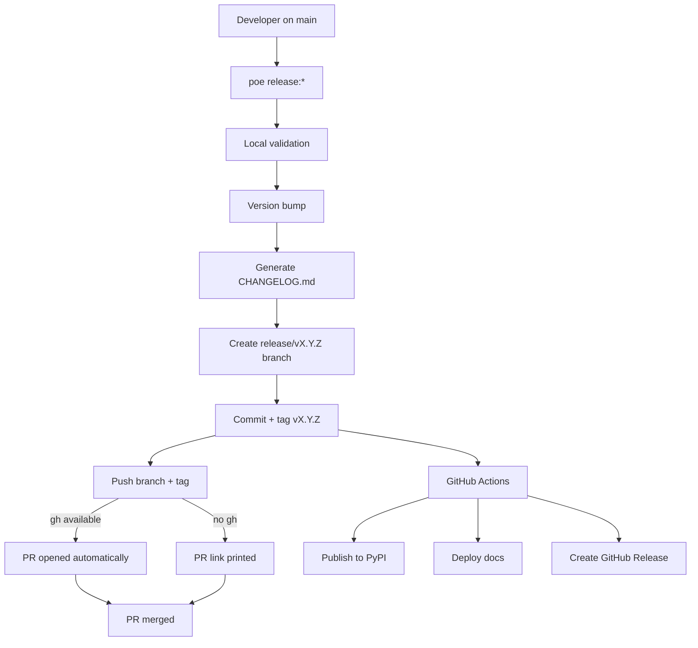

# Release Guide

This document explains **how releases work in ForgingBlocks**, **why the process is designed this way**, and **how contributors should perform a release safely and correctly**.

The goal is to make releases:

- predictable
- auditable
- reproducible
- fully automated

> **Important principle**
> Contributors *never* publish packages or deploy documentation manually.
> All publishing happens in **GitHub Actions**, triggered by a **Git tag**.

---

## Mental Model (Read This First)

ForgingBlocks follows a **release-branch + tag–driven release model**:

- A **release branch** expresses *intent to release*
- A **Git tag (`vX.Y.Z`) is the single release signal**
- Local tooling (**Poe**) is responsible only for:
  - validating the release
  - bumping the version
  - generating the changelog
  - creating a release branch
  - creating and pushing the tag
  - opening a Pull Request
- **GitHub Actions** is responsible for:
  - publishing to PyPI
  - deploying versioned documentation
  - creating the GitHub Release

If no tag is pushed, **no release happens**.

---

## Commit Convention (Required)

Automatic changelog generation relies on commit messages following this format:

```
type(scope?): description
```

Where `type` is one of:

- feat
- fix
- docs
- refactor
- perf
- test
- chore
- breaking

Examples:

```
feat(domain): add Result.map_error
fix(application): handle empty payload
docs: clarify release process
breaking(api): remove legacy notifier
```

Commits that do not follow this convention **will not appear in the changelog**.

---

## Why Releases Use a Branch

The `main` branch is **protected**.

This means:
- no direct pushes
- no direct version bumps
- no bypassing PR reviews

Therefore:

> **All releases are prepared on a `release/vX.Y.Z` branch and merged via Pull Request.**

---

## Quick Start

```bash
git checkout main
git pull origin main
poetry run poe release:patch   # or release:minor / release:major
```

This command:
- bumps the version
- generates the changelog
- creates a release branch
- creates and pushes the tag
- opens a Pull Request automatically (if `gh` is installed)

---

## Automatic Pull Request Creation

Release tasks automatically open a Pull Request using the **GitHub CLI (`gh`)**.

If `gh` is not installed, the command prints a PR link instead.

---

## Automation in GitHub Actions

When the tag `vX.Y.Z` is pushed, GitHub Actions automatically:

1. Re-validates the release
2. Publishes the package to PyPI
3. Deploys versioned documentation using `mike`
4. Updates the `latest` docs alias
5. Creates a GitHub Release using the generated changelog

---

## Release Flow Diagram



---

## Maintainer Release Checklist

### Before
- [ ] `main` is up to date
- [ ] CI is green
- [ ] Working tree is clean
- [ ] Commit messages follow convention
- [ ] `gh auth status` succeeds (optional)

### During
- [ ] Run `poe release:*`
- [ ] Changelog generated
- [ ] Tag exists on GitHub
- [ ] PR opened automatically or link printed

### After
- [ ] PyPI published
- [ ] Docs deployed
- [ ] GitHub Release created
- [ ] PR merged

---

## Summary

1. Run a release command
2. Changelog is generated
3. PR opens automatically
4. Tag triggers CI
5. Docs and package are published
6. Merge PR
7. Done
