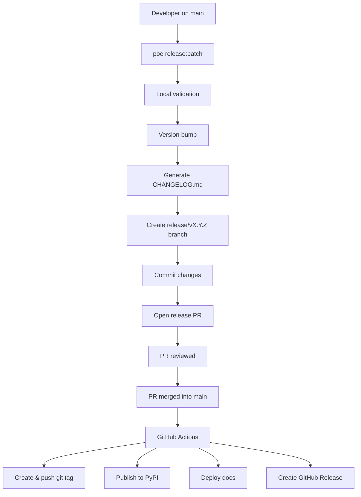

# Release Guide

This document explains **how releases work in ForgingBlocks**, **why the process is designed this way**, and **how contributors should perform a release safely and correctly**.

The goal is to make releases:

- predictable
- auditable
- reproducible
- fully automated

!!! note "Important principle"
    Contributors prepare releases locally, create PRs for review, and **all publishing happens automatically in GitHub Actions**.
    When the release PR is merged into `main` it will triggers the package publishing and docs deploy.

---

## TL;DR – Quick Release

```bash
# 1. Validate everything is ready
git checkout main && git pull origin main

# 2. Test the release first (simulation)
poetry run poe release patch

# 3. Execute when ready
poetry run poe release patch --execute

# 4. Review and merge the created PR
# 5. GitHub Actions handles the rest automatically
```

> **💡 Always simulate first**: Run without `--execute` to validate before creating the release PR.

## How to Release

### Prerequisites

Before releasing, ensure:

- [ ] All intended changes are merged into `main`
- [ ] CI is green on `main`
- [ ] Working tree is clean
- [ ] You're on the `main` branch and synced with origin

### Release Commands

The release process uses a single poe task with different levels:

```bash
# Always start with simulation (safe, no changes)
poetry run poe release patch    # 0.3.6 → 0.3.7
poetry run poe release minor    # 0.3.6 → 0.4.0
poetry run poe release major    # 0.3.6 → 1.0.0

# Execute when ready (creates branch and PR)
poetry run poe release patch --execute    # Actually performs the release
poetry run poe release minor --execute    # Actually performs the release
poetry run poe release major --execute    # Actually performs the release
```

### What Happens Locally

When you run `poetry run poe release [level] --execute`, the tooling automatically:

1. **Validates** repository state (clean, on main, synced)
2. **Bumps version** in pyproject.toml
3. **Generates changelog** from commit messages
4. **Creates release branch** (`release/vX.Y.Z`)
5. **Commits changes** to the release branch
6. **Opens Pull Request** for code review

### What Happens After Merge

When the release PR is merged into `main`, GitHub Actions automatically:

1. **Creates and pushes tag** (from branch name `release/vX.Y.Z`)
2. **Builds and publishes** package to PyPI
3. **Deploys documentation** to GitHub Pages
4. **Creates GitHub Release** with changelog

> **🔒 Important**: Publishing only happens after PR merge. If the PR is rejected, nothing gets released.

---

## Mental Model (Read This First)

ForgingBlocks follows a **local-preparation + automated-publishing model**:

- **Local tooling** (`poetry run poe release`) automatically:
  - validates the release
  - bumps the version
  - generates the changelog
  - creates the release branch
  - commits changes
  - opens a Pull Request
- **GitHub Actions** automatically:
  - creates and pushes tags (from branch name)
  - validates the release candidate
  - builds the package
  - publishes to PyPI
  - deploys versioned documentation

**Publishing only happens after the release PR is merged.**

---

## Why This Flow Design?

**Local preparation ensures quality:**
- Contributors validate everything before creating PRs
- Simulation mode allows safe testing
- All changes are reviewed before publishing

**GitHub Actions handles publishing:**
- Fully automated after PR merge
- No local credentials needed
- Clear audit trail through GitHub Actions logs

This separation ensures that:
✅ **No releases without code review**
✅ **No local environment dependencies for publishing**
✅ **Clear audit trail for all releases**
✅ **Consistent tagging from branch names**

---

## Commit Convention (Required)

Automatic changelog generation relies on commit messages following this format:

```
type(scope?): description
```

Valid `type` values:

- feat
- fix
- docs
- refactor
- perf
- test
- chore
- breaking

Examples:

```
feat(domain): add Result.map_error
fix(application): handle empty payload
docs: clarify release process
breaking(api): remove legacy notifier
```

Commits that do not follow this convention **will not appear in the changelog**.

---

## When to Release

Use the release tooling when:

- **Feature complete**: All intended changes are merged into `main`
- **Quality verified**: CI is green and tests pass
- **Ready for users**: The version increment reflects the changes (patch/minor/major)

Don't release if:
- CI is failing on `main`
- You have uncommitted changes
- You're not on the `main` branch

The release tooling enforces these prerequisites automatically.

---

## Release Tooling

Release automation is implemented as a Python module that contributors access via poe tasks:

```bash
# Test release preparation (safe simulation)
poetry run poe release [patch|minor|major]

# Execute release (creates branch and PR)
poetry run poe release [patch|minor|major] --execute
```

The tooling handles version bumping, changelog generation, branch creation, and PR opening automatically.

---

## Publishing in GitHub Actions

When the release Pull Request is merged into `main`, GitHub Actions automatically:

1. **Creates and pushes the git tag** (extracted from release branch name)
2. **Validates the release candidate** (runs CI checks and builds)
3. **Publishes the package to PyPI** (using poetry publish)
4. **Deploys documentation to GitHub Pages** (updates latest docs)

---

## Release Flow Diagram



---

## Release Commands Reference

### Available Commands

```bash
# Simulation mode (safe, no changes)
poetry run poe release patch    # 0.3.6 → 0.3.7
poetry run poe release minor    # 0.3.6 → 0.4.0
poetry run poe release major    # 0.3.6 → 1.0.0

# Execution mode (creates branch, tag, and PR)
poetry run poe release patch --execute    # 0.3.6 → 0.3.7
poetry run poe release minor --execute    # 0.3.6 → 0.4.0
poetry run poe release major --execute    # 0.3.6 → 1.0.0
```

### Command Behavior

| Mode | Creates Branch | Creates Tag | Opens PR | Safe to Run |
|------|----------------|-------------|----------|-------------|
| **Simulation** (default) | ❌ | ❌ | ❌ | ✅ Always safe |
| **Execute** (`--execute`) | ✅ | ✅ | ✅ | ⚠️ Only when ready |

> **🔒 Safety First**: Always run simulation mode first to validate the release.

---

## Maintainer Checklist

- [ ] Run `poetry run poe release [level]` (test)
- [ ] Run `poetry run poe release [level] --execute` (execute)
- [ ] Review and merge the PR
- [ ] Verify PyPI, docs, and GitHub Release

---

## Summary

Prepare → Review → Merge → GitHub Actions publishes.
