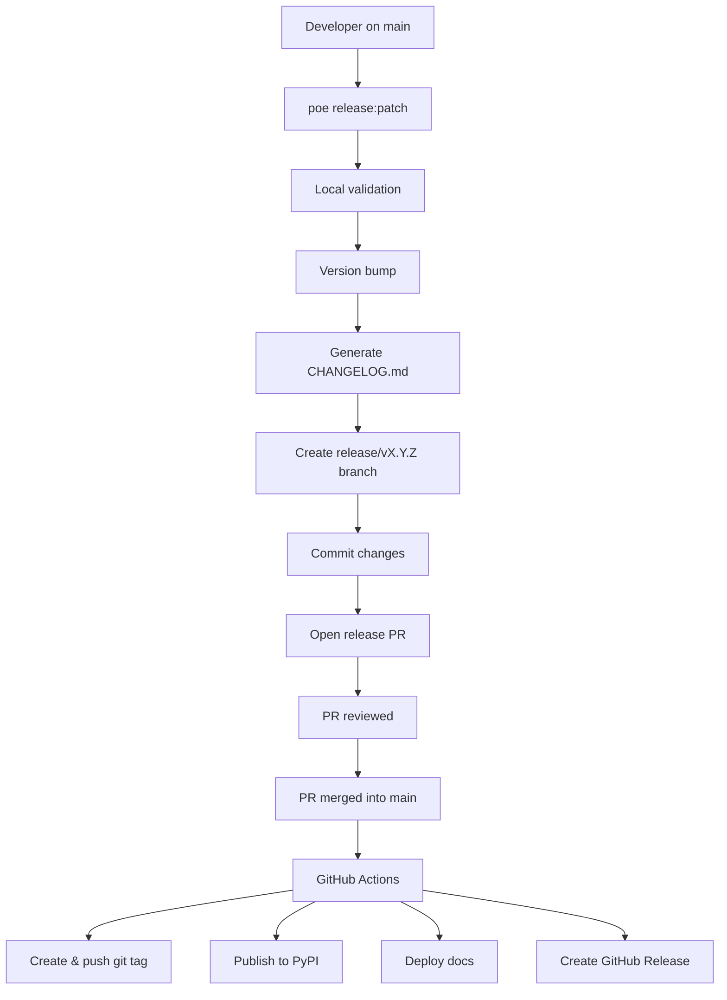

# Release Guide

This document explains **how releases work in ForgingBlocks**, **why the process is designed this way**, and **how contributors should perform a release safely and correctly**.

The goal is to make releases:

- predictable
- auditable
- reproducible
- fully automated

> **Important principle**
> Contributors *never* publish packages or deploy documentation manually.
> All publishing happens in **GitHub Actions**, triggered when the **release Pull Request is merged into `main`**.

---

## TL;DR – Releasing ForgingBlocks

Before releasing:

- [ ] All intended changes are merged into `main`
- [ ] CI is green on `main`
- [ ] Working tree is clean
- [ ] Commit messages follow the changelog convention

To prepare a release:

```bash
git checkout main
git pull origin main
poetry run poe release:patch   # or release:minor / release:major
```

Then:

- [ ] Review the automatically created release PR
- [ ] Merge the release PR into `main`

After merge:

- [ ] GitHub Actions publishes the package to PyPI
- [ ] Docs are deployed and `latest` is updated
- [ ] GitHub Release is created

**If the PR is not merged, nothing is released.
Never publish manually.**

---

## Mental Model (Read This First)

ForgingBlocks follows a **release-branch–driven model**:

- A **release branch** expresses intent to release
- A **Git tag (`vX.Y.Z`) identifies the release**
- Local tooling (**Poe + release scripts**) is responsible for:
  - validating the release
  - bumping the version
  - generating the changelog
  - creating the release branch
  - creating the tag
  - opening a Pull Request
- **GitHub Actions** is responsible for:
  - publishing to PyPI
  - deploying versioned documentation
  - creating the GitHub Release

Publishing only happens **after the release PR is merged**.

---

## Commit Convention (Required)

Automatic changelog generation relies on commit messages following this format:

```
type(scope?): description
```

Valid `type` values:

- feat
- fix
- docs
- refactor
- perf
- test
- chore
- breaking

Examples:

```
feat(domain): add Result.map_error
fix(application): handle empty payload
docs: clarify release process
breaking(api): remove legacy notifier
```

Commits that do not follow this convention **will not appear in the changelog**.

---

## Why Releases Use a Branch

The `main` branch is **protected**:

- no direct pushes
- no direct version bumps
- no bypassing PR reviews

Therefore:

> **All releases are prepared on a `release/vX.Y.Z` branch and merged via Pull Request.**

---

## Release Tooling

Release automation lives in:

```
scripts/release/
```

```
scripts/release/
├── VERSION
├── common.sh
├── prepare.sh
├── create_pr.sh
└── dry_run.sh
```

The file `scripts/release/VERSION` tracks the version of the release tooling itself.

---

## Publishing in GitHub Actions

When the release Pull Request is merged into `main`, GitHub Actions automatically:

1. Publishes the package to PyPI
2. Deploys versioned documentation
3. Updates the `latest` docs alias
4. Creates a GitHub Release

---

## Release Flow Diagram



---

## Maintainer Checklist

- [ ] Run `poe release:*`
- [ ] Review PR
- [ ] Merge PR
- [ ] Verify PyPI, docs, and GitHub Release

---

## Summary

Prepare → Review → Merge → GitHub Actions publishes.
