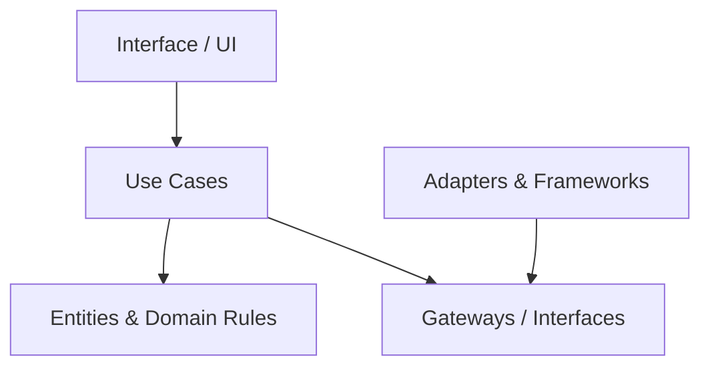

# 🧼 Clean Architecture (Optional Style)

!!! abstract "Important"
    ForgingBlocks does **not** require Clean Architecture.
    This is only an example showing how its building blocks can fit into a Clean-style approach.

Clean Architecture emphasizes:

- inward-facing dependency rules
- use cases coordinating behavior
- separation between core logic and technical details

## Diagram



## Example

```python
from typing import Protocol
from dataclasses import dataclass
from forging_blocks.foundation import Result, Ok, Err

@dataclass
class User:
    email: str

class UserGateway(Protocol):
    def save(self, user: User) -> Result[None, str]:
        ...

@dataclass
class RegisterUserInput:
    email: str

class RegisterUser:
    def __init__(self, gateway: UserGateway) -> None:
        self._gateway = gateway

    def execute(self, data: RegisterUserInput) -> Result[None, str]:
        if "@" not in data.email:
            return Err("invalid email")

        return self._gateway.save(User(email=data.email))
```
