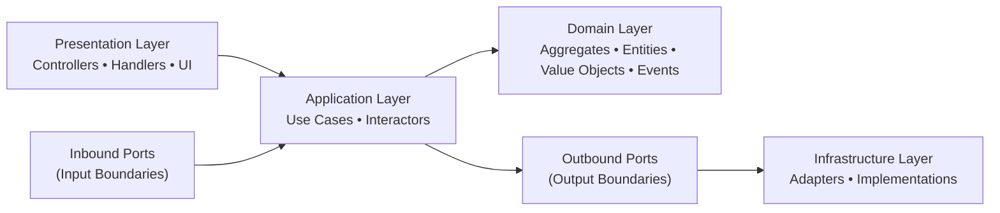
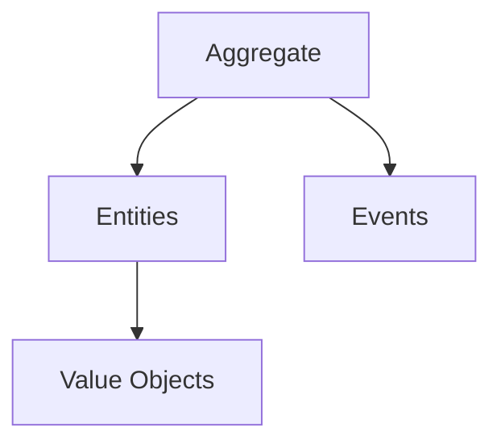
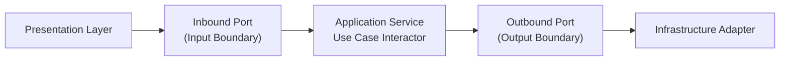
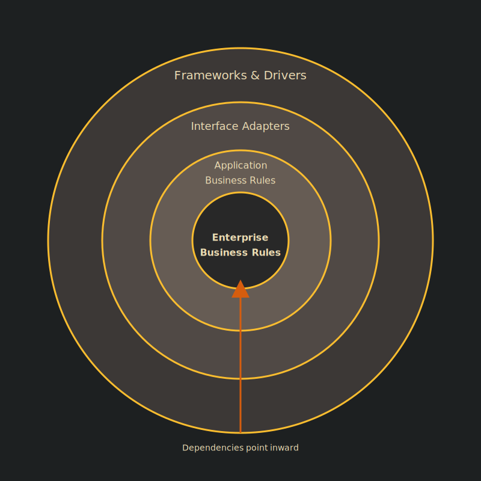

# Clean Architecture

!!! note "Important"
    ForgingBlocks does **not** require Clean Architecture.

    Clean Architecture is a structured variant of layered/hexagonal principles emphasizing strict inward dependencies and explicit use cases.

---

# 1. Clean Architecture — Layer Responsibilities

---

# 2. Domain Composition

---

# 3. Ports & Adapters (Clean Architecture)

---

# 4. Summary

Clean Architecture is a refined layered model with strict dependency direction and explicit use cases.

ForgingBlocks integrates cleanly with this structure without enforcing it.

---

# 5. Traditional Clean Architecture Diagram

