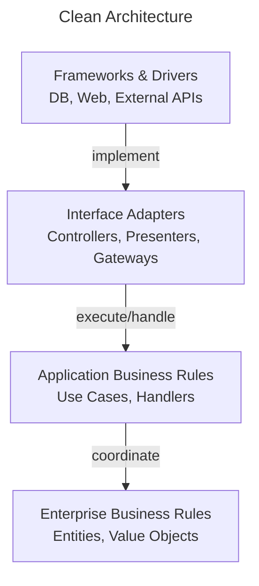

# Clean Architecture

Clean Architecture organizes software around **behavioral boundaries** and dependency rules that protect core policies from external details.

This page shows how **ForgingBlocks concepts can be projected** onto a Clean Architecture arrangement.

!!! note "Important"
    ForgingBlocks does **not** enforce Clean Architecture.
    This page presents it as an **interpretation**, not a required structure.

## Conceptual mapping

- The inner layers contain Domain and Application policies.
- The outer layers contain delivery mechanisms and technical details.
- Dependencies always point inward.

The diagram below shows the **canonical Clean Architecture view** from the literature, independent of ForgingBlocks.

## When this style fits

- Long-term maintainability is a priority.
- Strict separation between policy and details is required.
- Multiple delivery mechanisms are expected.

## When to consider alternatives

- Simplicity outweighs flexibility.
- Strict dependency rules add unnecessary overhead.
- The system is small or short-lived.
