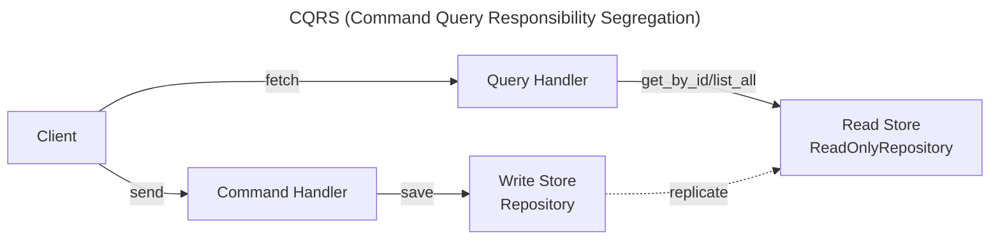

# CQRS

Command Query Responsibility Segregation separates write behavior from read behavior.

This page shows how **ForgingBlocks concepts can be projected** to support a CQRS-style design.

!!! note "Important"
    ForgingBlocks does **not** require CQRS.
    This page presents it as an **architectural pattern**, not a requirement.

## Conceptual mapping

- Commands express intent to change state.
- Queries retrieve information.
- Read and write responsibilities are separated.
- Models may diverge over time.

The diagram below shows a **canonical CQRS view** from the literature.

## When this style fits

- Read and write workloads differ significantly.
- Scalability concerns dominate.
- Eventual consistency is acceptable.
