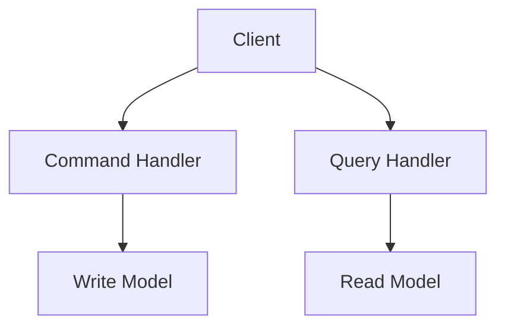

# 🔀 CQRS (Command Query Responsibility Segregation)

!!! abstract "Important"
    ForgingBlocks does **not** require CQRS.
    This example demonstrates how CQRS-style separation can be expressed.

## Diagram



## Example

```python
from dataclasses import dataclass
from typing import Protocol
from forging_blocks.foundation import Result, Ok, Err

@dataclass
class CreateTaskCommand:
    title: str

class TaskWriter(Protocol):
    def create(self, title: str) -> Result[int, str]:
        ...

class CreateTaskHandler:
    def __init__(self, writer: TaskWriter) -> None:
        self._writer = writer

    def handle(self, cmd: CreateTaskCommand) -> Result[int, str]:
        if not cmd.title.strip():
            return Err("title required")
        return self._writer.create(cmd.title)
```
