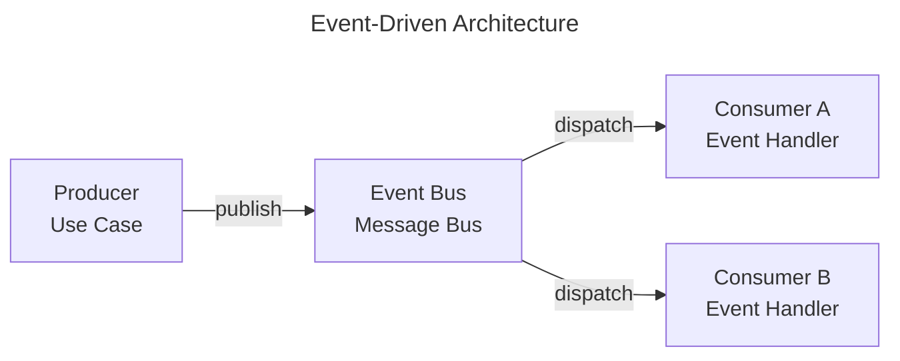

# Event-Driven Architecture

Event-Driven Architecture focuses on reacting to events and propagating facts across system boundaries.

This page shows how **ForgingBlocks abstractions can participate** in an event-driven design.

!!! note "Important"
    ForgingBlocks does **not** require an event-driven architecture.
    This page presents it as a **pattern**, not a mandate.

## Conceptual mapping

- Domain events represent facts that occurred.
- Event handlers react to those events.
- Message buses route events between components.
- Components remain loosely coupled.

The diagram below shows a **canonical event-driven flow** from the literature.

## When this style fits

- Loose coupling is required.
- Asynchronous processing is desirable.
- Integration with external systems is frequent.
