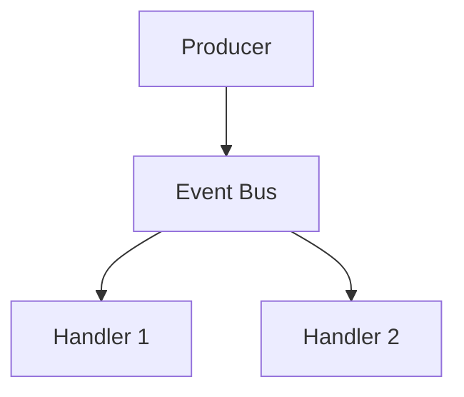

# 📣 Event‑Driven Architecture

!!! abstract "Important"
    ForgingBlocks does **not** require event‑driven design.
    This example shows how events can be modeled using its abstractions.

## Diagram



## Example

```python
from dataclasses import dataclass
from typing import Protocol, Iterable
from forging_blocks.foundation import Result, Ok, Err

@dataclass(frozen=True)
class UserRegisteredEvent:
    email: str

class EventPublisher(Protocol):
    def publish(self, events: Iterable[object]) -> Result[None, str]:
        ...

@dataclass
class RegisterUserInput:
    email: str

class RegisterUser:
    def __init__(self, publisher: EventPublisher) -> None:
        self._publisher = publisher

    def execute(self, data: RegisterUserInput) -> Result[None, str]:
        if "@" not in data.email:
            return Err("invalid email")
        return self._publisher.publish(
            [UserRegisteredEvent(email=data.email)]
        )
```
