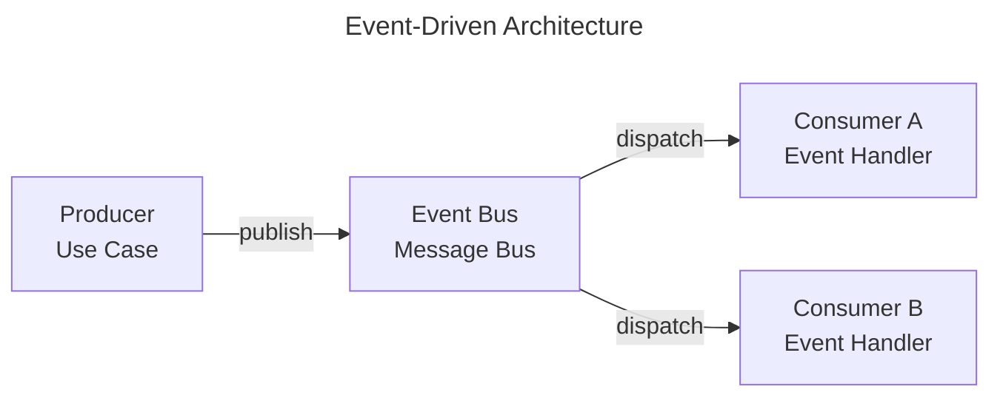

# Event-Driven Architecture

Event-Driven Architecture focuses on reacting to events and propagating facts across system boundaries.

This page shows how **ForgingBlocks abstractions can participate** in an event-driven design.

!!! note "Important"
    ForgingBlocks does **not** require an event-driven architecture.
    This page presents it as a **pattern**, not a mandate.

---

## Quick summary

Event-Driven Architecture focuses on **reacting to events** and **propagating facts** across system boundaries. This page shows how **ForgingBlocks abstractions can participate** in this design — **not required**.

Mapping:
- **Domain Events** — Facts that occurred (`Event`, past tense, immutable)
- **Event Handlers** — React to events (`EventHandlerPort`, `MessageHandlerPort[EventType, None]`)
- **Message Bus** — Routes events between components (`MessageBusPort` outbound port)
- **Loose coupling** — Components don't call each other directly

Fits when: loose coupling required; asynchronous processing desirable; frequent external system integration.

---

## Conceptual mapping

- Domain events represent facts that occurred.
- Event handlers react to those events.
- Message buses route events between components.
- Components remain loosely coupled.

The diagram below shows a **canonical event-driven flow** from the literature.

```mermaid
---
title: Event-Driven Architecture
---
graph LR
    Producer[Producer<br/>Use Case] -->|publish| EventBusPort[Event Bus<br/>Message Bus]
    EventBusPort -->|dispatch| ConsumerA[Consumer A<br/>Event Handler]
    EventBusPort -->|dispatch| ConsumerB[Consumer B<br/>Event Handler]
```

---

## When this style fits

- Loose coupling is required.
- Asynchronous processing is desirable.
- Integration with external systems is frequent.
