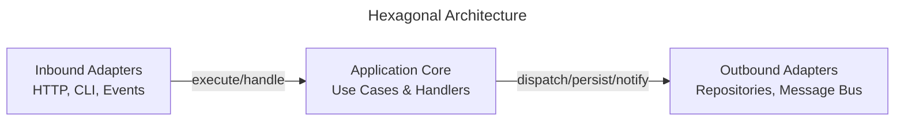

# Hexagonal Architecture

Hexagonal Architecture, also known as Ports and Adapters, emphasizes separation between core behavior and external systems.

This page shows how **ForgingBlocks concepts can be projected** onto a hexagonal arrangement.

!!! note "Important"
    ForgingBlocks does **not** enforce Hexagonal Architecture.
    This page presents it as an **interpretation** of responsibilities defined in the Reference section.

## Conceptual mapping

- The core contains Domain and Application logic.
- Inbound ports define how behavior is triggered.
- Outbound ports define required external capabilities.
- Adapters implement those ports.
- Dependencies point toward the core.

The diagram below shows a **canonical hexagonal view** from the literature, independent of ForgingBlocks.

## When this style fits

- External systems change frequently.
- Testing without infrastructure is important.
- Inbound and outbound interactions must be isolated.
