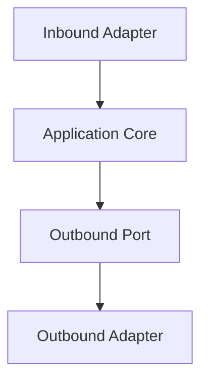

# ⬡ Hexagonal Architecture (Ports & Adapters)

!!! abstract "Important"
    ForgingBlocks does **not** require Hexagonal Architecture.
    This page shows how its abstractions align with a Ports & Adapters style.

Hexagonal Architecture focuses on:

- clear inbound and outbound ports
- adapters that implement ports
- isolation of core logic

## Diagram



## Example

```python
from typing import Protocol
from dataclasses import dataclass
from forging_blocks.foundation import Result, Ok, Err

class PaymentPort(Protocol):
    def charge(self, user_id: int, amount: int) -> Result[None, str]:
        ...

@dataclass
class ChargeUserInput:
    user_id: int
    amount: int

class ChargeUser:
    def __init__(self, payments: PaymentPort) -> None:
        self._payments = payments

    def execute(self, data: ChargeUserInput) -> Result[None, str]:
        if data.amount <= 0:
            return Err("amount must be positive")
        return self._payments.charge(data.user_id, data.amount)
```
