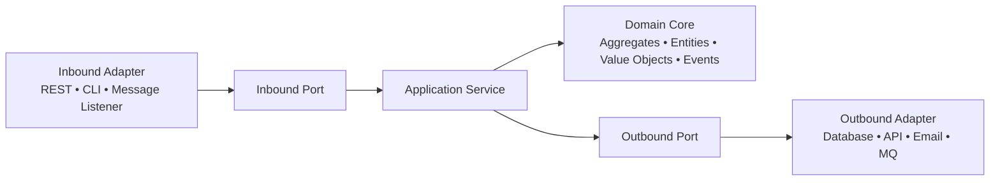
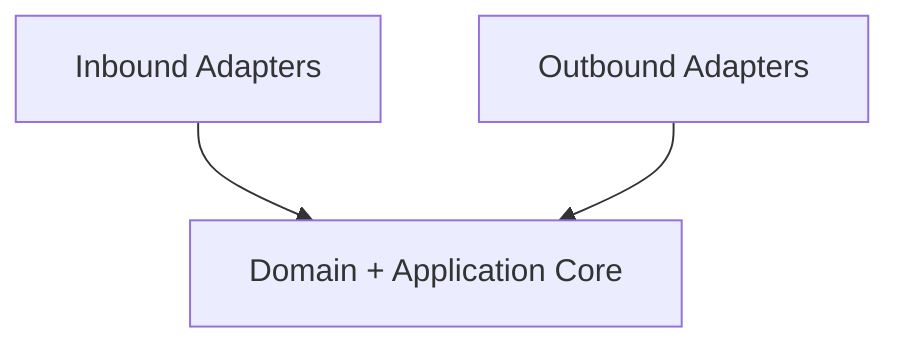

# Hexagonal Architecture (Ports & Adapters)

!!! note "Important"
    ForgingBlocks does **not** require Hexagonal Architecture.
    Hexagonal Architecture focuses on isolating the core domain behind ports, with adapters surrounding it.

---

# 1. Core Hexagonal Model

---

# 2. Hexagon Shape Representation

---

# 3. Key Points

- Domain Core is the **center** of the hexagon.
- Communication happens only through **ports**, never directly.
- Adapters are replaceable.
- The architecture is driven by **runtime boundaries**, not concentric layers.
