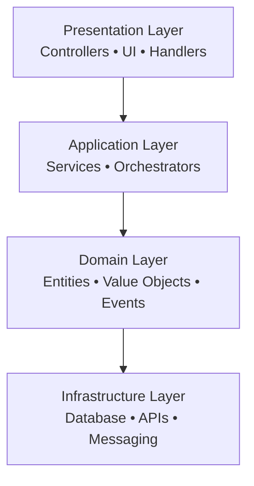

# Layered Architecture

!!! note "Important"
    ForgingBlocks does **not** require classical layered architecture.
    Layered Architecture is the simplest conceptual model and often the foundation of Clean and Hexagonal styles.

---

# 1. Traditional Layer Stack

---

# 2. Notes

- Dependencies traditionally flow **downwards**.
- Application uses domain, Presentation uses application, etc.
- Unlike Clean/Hexagonal, strict inward rules are not required unless imposed by convention.
