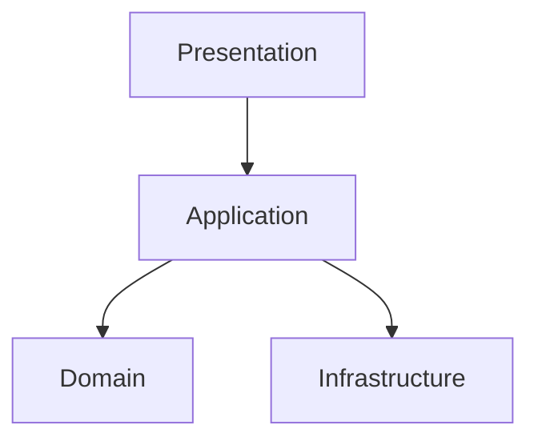

# 🧱 Layered Architecture

!!! abstract "Important"
    ForgingBlocks does **not** require layered architecture.
    You may map blocks into layers if that mental model helps.

## Diagram



## Example

```python
from dataclasses import dataclass
from forging_blocks.foundation import Result, Ok, Err

@dataclass
class Order:
    id: int
    total: int

class OrderService:
    def __init__(self, tax_rate: float) -> None:
        self._tax_rate = tax_rate

    def compute_total(self, base: int) -> Result[Order, str]:
        if base < 0:
            return Err("base amount must be non-negative")
        total = int(base * (1 + self._tax_rate))
        return Ok(Order(id=1, total=total))
```
