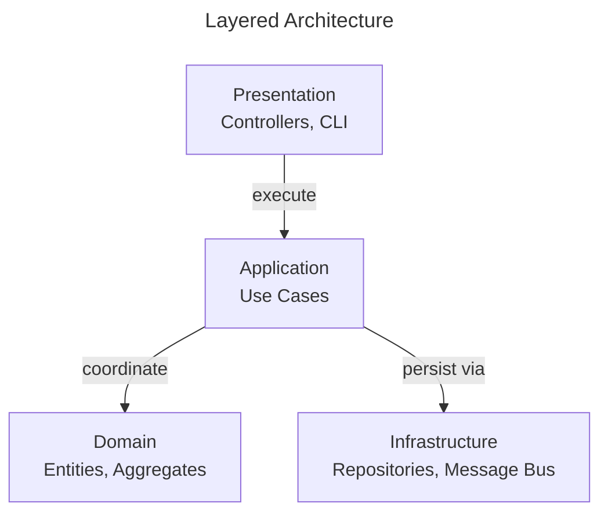

# Layered Architecture

Layered Architecture organizes software into horizontal layers, each with a distinct responsibility.

This page shows how **ForgingBlocks concepts can be projected** onto a traditional layered arrangement.

!!! note "Important"
    ForgingBlocks does **not** require a layered architecture.
    This page presents Layered Architecture as an **interpretation** of responsibilities defined in the Reference section.

## Conceptual mapping

- Presentation handles input and output concerns.
- Application coordinates behavior.
- Domain contains problem-space concepts.
- Infrastructure provides technical implementations.
- Dependencies typically flow downward.

The diagram below shows a **canonical layered view** from the literature, independent of ForgingBlocks.

## When this style fits

- The system is relatively small.
- Architectural complexity is not required.
- Simplicity and familiarity are prioritized.

## When to consider alternatives

- Strict dependency control is required.
- Inbound and outbound interactions must be isolated.
- Message-driven or asynchronous workflows are central.
