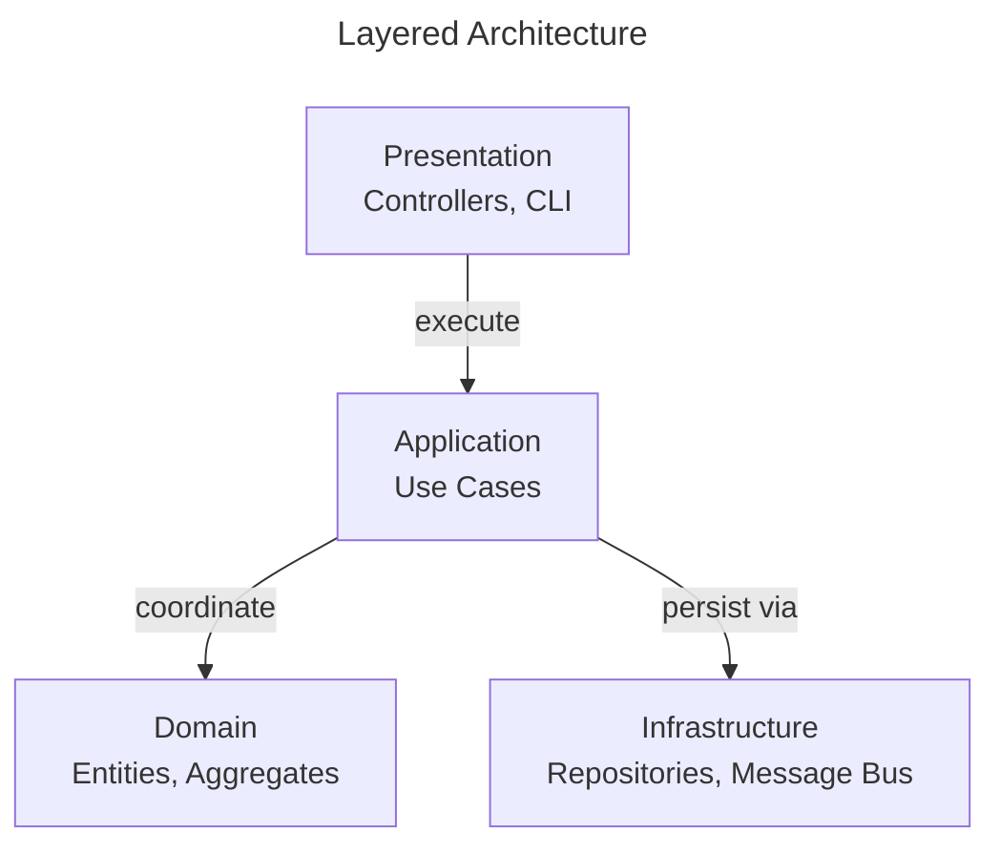

# Layered Architecture

Layered Architecture organizes software into horizontal layers, each with a distinct responsibility.

This page shows how **ForgingBlocks concepts can be projected** onto a traditional layered arrangement.

!!! note "Important"

---

## Quick summary

Layered Architecture organizes software into horizontal layers with distinct responsibilities. This page shows how **ForgingBlocks concepts can be projected** onto this arrangement — **not required**.

Mapping:
- **Presentation** — Input/output (Controllers, CLI)
- **Application** — Coordinates behavior (Use Cases)
- **Domain** — Problem-space concepts (Entities, Aggregates)
- **Infrastructure** — Technical implementations (Repositories, Message Bus)
- **Dependencies flow downward**

Fits when: system is relatively small; architectural complexity not required; simplicity/familiarity prioritized.
Consider alternatives when: strict dependency control needed; inbound/outbound isolation required; message-driven/async workflows central.

---

- Presentation handles input and output concerns.
- Application coordinates behavior.
- Domain contains problem-space concepts.
- Infrastructure provides technical implementations.
- Dependencies typically flow downward.

The diagram below shows a **canonical layered view** from the literature, independent of ForgingBlocks.

```mermaid
---
title: Layered Architecture
---
graph TD
    Presentation[Presentation<br/>Controllers, CLI] -->|execute| Application[Application<br/>Use Cases]
    Application -->|coordinate| Domain[Domain<br/>Entities, Aggregates]
    Application -->|persist via| Infrastructure[Infrastructure<br/>Repositories, Message Bus]
```

---

## When this style fits

- The system is relatively small.
- Architectural complexity is not required.
- Simplicity and familiarity are prioritized.

---

## When to consider alternatives

- Strict dependency control is required.
- Inbound and outbound interactions must be isolated.
- Message-driven or asynchronous workflows are central.
