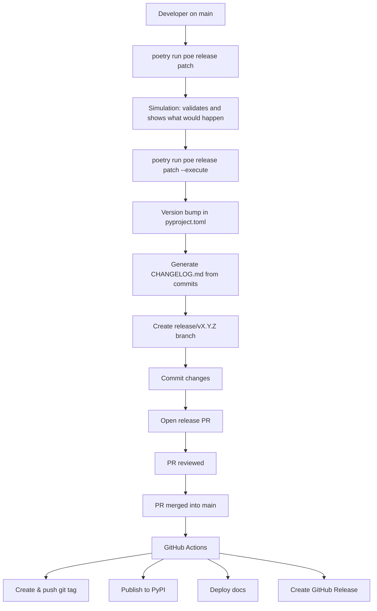

# Release Guide

This document explains **how releases work in ForgingBlocks**, **why the process is designed this way**, and **how contributors should perform a release safely and correctly**.

The goal is to make releases:

- predictable
- auditable
- reproducible
- fully automated

!!! note "Important principle"
    Contributors prepare releases locally, create PRs for review, and **all publishing happens automatically in GitHub Actions**.
    When the release PR is merged into `main` it will trigger the package publishing and docs deploy.

---

## TL;DR – Quick Release

```bash
# 1. Validate everything is ready
git checkout main && git pull origin main

# 2. Test the release first (simulation)
poetry run poe release patch

# 3. Execute when ready
poetry run poe release patch --execute

# 4. Review and merge the created PR
# 5. GitHub Actions handles the rest automatically
```
> **Tip**: Always simulate first — run without `--execute` to validate before creating the release PR.

### Prerequisites

Before releasing, ensure:

- [ ] All intended changes are merged into `main`
- [ ] CI is green on `main`
- [ ] Working tree is clean
- [ ] You're on the `main` branch and synced with origin

### Release Commands

The release process uses poe tasks with the `--execute` flag:

```bash
# Always start with simulation (safe, no changes)
poetry run poe release patch       # Prepare a patch release from the current version
poetry run poe release minor       # Prepare a minor release from the current version
poetry run poe release major       # Prepare a major release from the current version

# Execute when ready (creates a release branch and PR)
poetry run poe release patch --execute
poetry run poe release minor --execute
poetry run poe release major --execute
```

### What Happens Locally

When you run `poetry run poe release patch --execute`, the tooling automatically:

1. **Validates** repository state (clean, on main, synced)
2. **Bumps version** in pyproject.toml
3. **Generates changelog** from commit messages
4. **Creates release branch** (`release/vX.Y.Z`)
5. **Commits changes** to the release branch
6. **Opens Pull Request** for code review

### What Happens After Merge

When the release PR is merged into `main`, GitHub Actions automatically:

1. **Creates and pushes the version tag** from the release branch name
2. **Validates the release version** and builds the package
3. **Publishes the package to PyPI** with the PyPA trusted-publishing action
4. **Deploys versioned documentation** and updates the `latest` alias
5. **Creates the GitHub Release** with the generated changelog

> **Important**: Publishing only happens after PR merge. If the PR is rejected, nothing gets released.
---

## Mental Model (Read This First)

ForgingBlocks follows a **local-preparation + automated-publishing model**:

- **Local tooling** (`poetry run poe release patch`) automatically:
  - Validates the release.
  - Bumps the version.
  - Generates the changelog.
  - Creates the release branch.
  - Commits changes.
  - Opens a Pull Request.

- **GitHub Actions** automatically after the release PR is merged:
  - Creates and pushes the version tag.
  - Validates the release candidate and builds the package.
  - Publishes to PyPI through the PyPA trusted-publishing action.
  - Deploys versioned documentation and updates the `latest` alias.
  - Creates the GitHub Release.

---

## Why This Flow Design?

**Local preparation ensures quality:**
- Contributors validate everything before creating PRs
- Simulation mode allows safe testing
- All changes are reviewed before publishing

**GitHub Actions handles publishing:**
- Fully automated after PR merge
- No local credentials needed
- Clear audit trail through GitHub Actions logs

This separation ensures that:
**No releases without code review**
**No local environment dependencies for publishing**
**Clear audit trail for all releases**
**Consistent tagging from branch names**

---

## Commit Convention (Required)

Automatic changelog generation relies on commit messages following this format:

```
type(scope?): description
```

Valid `type` values:

- feat
- fix
- docs
- refactor
- perf
- test
- chore

Examples:

```
feat(domain): add Result.map_error
fix(application): handle empty payload
docs: clarify release process
breaking(api): remove legacy notifier
```

Commits that do not follow this convention **will not appear in the changelog**.

---

## When to Release

Use the release tooling when:

- **Feature complete**: All intended changes are merged into `main`
- **Quality verified**: CI is green and tests pass
- **Ready for users**: The version increment reflects the changes (patch/minor/major)

Don't release if:
- CI is failing on `main`
- You have uncommitted changes
- You're not on the `main` branch

The release tooling enforces these prerequisites automatically.

---

## Release Tooling

Release automation is implemented as a Python module that contributors access via poe tasks:

```bash
# Test release preparation (safe simulation)
poetry run poe release patch       # Simulates patch release

# Execute release (creates branch and PR)
poetry run poe release patch --execute     # Actually performs the release
poetry run poe release minor --execute     # Minor release
poetry run poe release major --execute     # Major release
```

The tooling handles version bumping, changelog generation, branch creation, and PR opening automatically.

---

## Publishing in GitHub Actions

1. **Creates and pushes the git tag** extracted from the release branch name
2. **Validates the release candidate** and builds the package
3. **Publishes the package to PyPI** with `pypa/gh-action-pypi-publish`
4. **Deploys documentation to GitHub Pages** through the repository docs action

---

## Release Flow Diagram




> Tags are created automatically when releasing a version

---

## Release Commands Reference

### Available Commands

```bash
# Simulation mode (safe, no changes)
poetry run poe release patch
poetry run poe release minor
poetry run poe release major

# Execution mode (creates a release branch and opens a PR)
poetry run poe release patch --execute
poetry run poe release minor --execute
poetry run poe release major --execute
```

### Command Behavior

| Mode | Creates Branch | Creates Tag | Opens PR | Safe to Run |
|------|----------------|-------------|----------|-------------|
| **Simulation** (default) | No | No | No | Yes — no repository changes |
| **Execute** (`--execute`) | Yes | No | Yes | Review the generated changes and PR |

---

## Maintainer Checklist

- [ ] Run `poetry run poe release patch` (test simulation)
- [ ] Run `poetry run poe release patch --execute` (execute release)
- [ ] Review and merge the PR
- [ ] Verify PyPI, docs, and GitHub Release


## Versioned Documentation

Documentation is versioned using [mike](https://github.com/jimporter/mike). Each release gets its own immutable docs snapshot, while the `dev` version is updated on every push to `main`.

### Doc Versions

| Alias | Meaning |
|-------|---------|
| `dev` | Documentation generated from the current `main` branch |
| `latest` | Alias for the most recent released documentation |
| `vX.Y.Z` | Immutable documentation snapshot for a released version |

### Manual Docs Commands

```bash
poetry run poe docs:generate
poetry run poe docs:build
poetry run poe docs:serve
poetry run poe docs:deploy:dev
poetry run poe docs:deploy:release
poetry run poe docs:versions
```

### How It Works

- **`deploy-docs.yml`** generates and deploys the `dev` documentation on pushes to `main`.
- **`release.yml`** deploys the released documentation after the release workflow completes.

The version selector in the docs header lets users switch between versions.

---

## Summary

- **Simulate first**: Always run without `--execute` as a dry run
- **Review everything**: Simulation output shows the exact changes
- **Execute**: Only run with `--execute` when ready
- **Review and merge**: Check the release PR carefully
- **Remote publishes**: GitHub Actions handles PyPI, docs, and tags
