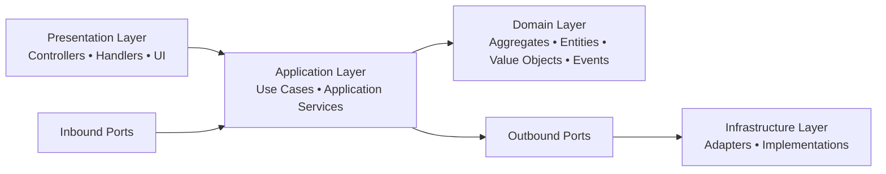
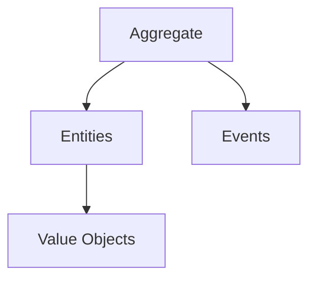
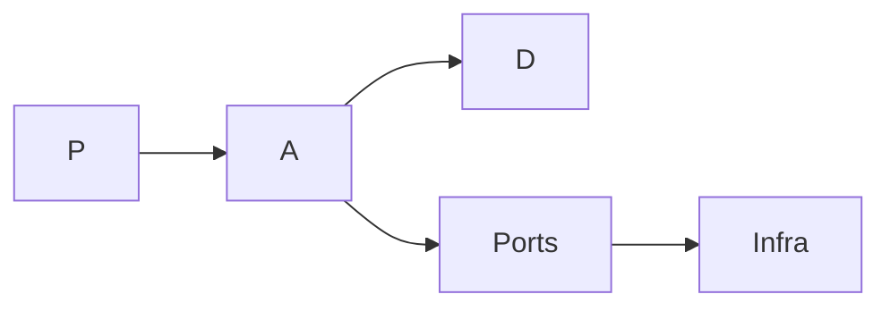

# ForgingBlocks — Simplified Architecture Overview

This document provides a clear, layered explanation of how applications built with ForgingBlocks are typically structured.
It replaces the previous all-in-one diagram with **three focused diagrams**, each capturing a single conceptual dimension.

---

# 1. High-Level Architectural Layers

A macro overview showing how requests flow through the system.

### Responsibilities

| Layer | Responsibility |
|-------|----------------|
| **Presentation** | Receives input, validates format, invokes use cases. |
| **Application** | Orchestrates workflows, uses the domain, defines ports. |
| **Domain** | Pure business rules and invariants. |
| **Infrastructure** | External concerns (DB, APIs, files, messaging). |

---

# 2. Domain Composition

A focused view of the internal structure of the domain model.

### Notes

- Aggregates enforce invariants.
- Entities hold identity and mutable state.
- Value Objects represent immutable validated concepts.
- Events capture domain changes.

---

# 3. Ports & Adapters (Hexagonal View)

Shows how the application communicates with the outside world.

### Key Principles

- Presentation does not call Infrastructure directly.
- Application owns and defines ports.
- Infrastructure implements outbound ports.
- Dependencies always point inward toward the core.

---

# 4. Summary

These three diagrams together provide a cohesive view of how ForgingBlocks applications are structured:

- **Layers Diagram** → overall system flow
- **Domain Composition Diagram** → internal domain structure
- **Ports & Adapters Diagram** → boundary interactions

This separation reduces cognitive load and clarifies the responsibilities of each part of the system.

---

# 5. Minimal TL;DR Diagram

