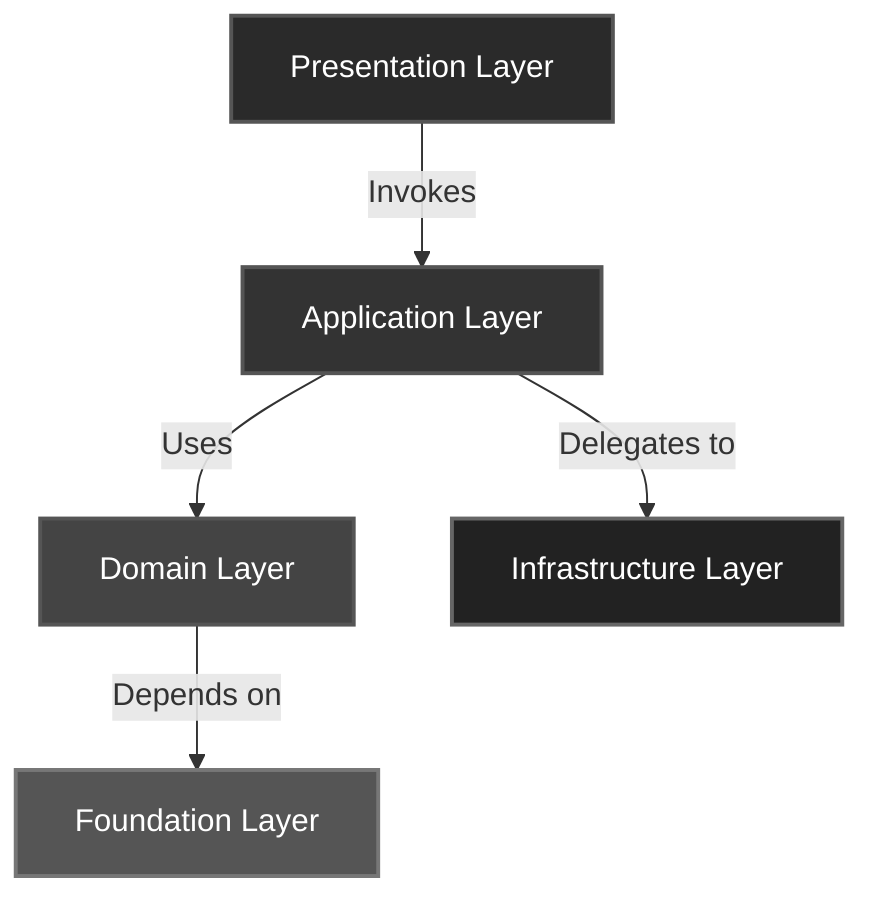
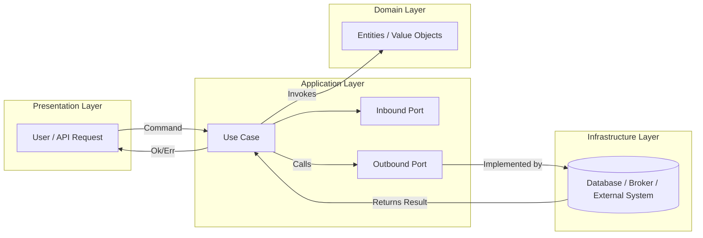

# Architecture Guide 🧠

The **BuildingBlocks** toolkit follows a composable architecture model based on clear **boundaries**, **contracts**, and **abstractions**.

It enables developers to design systems that are **testable**, **maintainable**, and **framework-agnostic**.

---

## 🧩 Core Idea

> “Architecture is about intent — code is about implementation.”

BuildingBlocks helps you express *intent* explicitly through **interfaces** (Ports) and **domain-driven abstractions** (Entities, Value Objects, Events).

This approach supports **Clean Architecture**, **Hexagonal Architecture**, and **DDD**, without enforcing any strict style.

---

## 🧠 Layers Overview

| Layer | Responsibility | Depends On |
|--------|----------------|------------|
| **Foundation** | Defines core abstractions like `Result`, `Port`, and `Mapper` | None |
| **Domain** | Encapsulates business rules and domain logic | Foundation |
| **Application** | Coordinates domain behavior via use cases and ports | Domain, Foundation |
| **Infrastructure** | Implements adapters for persistence, events, and I/O | Application, Domain |
| **Presentation** | Exposes entry points (API, CLI, etc.) | Application |

---

## 🧱 Design Principles

### 1. Explicit Boundaries

Each layer exposes only **what it must** and depends only on **contracts**, not implementations.

### 2. Dependency Inversion

High-level modules (domain and application) define interfaces.

Low-level modules (infrastructure, presentation) implement them.

### 3. Immutability

Entities and Value Objects are immutable by default, ensuring consistency and safe concurrency.

### 4. Composability

All abstractions (e.g., `Result`, `Port`, `Mapper`) can be reused and composed without framework dependencies.

---

## 🧩 Flow Example

1. **Presentation Layer** receives a command or query.

2. It invokes an **Application Use Case** through an **Inbound Port**.

3. The Use Case interacts with **Domain Entities** and **Value Objects**.

4. It delegates to **Outbound Ports** implemented by the **Infrastructure Layer**.

5. Results flow back as explicit `Result` objects (`Ok` / `Err`).

---

## ⚙️ Recommended Reading

- *Clean Architecture* — Robert C. Martin
- *Implementing Domain-Driven Design* — Vaughn Vernon
- *Patterns of Enterprise Application Architecture* — Martin Fowler
- *Get Your Hands Dirty on Clean Architecture* — Tom Hombergs

---

## ✅ Summary

BuildingBlocks is **not a framework** — it’s a **foundation**.

It helps you express intent, isolate concerns, and design systems that evolve gracefully.
