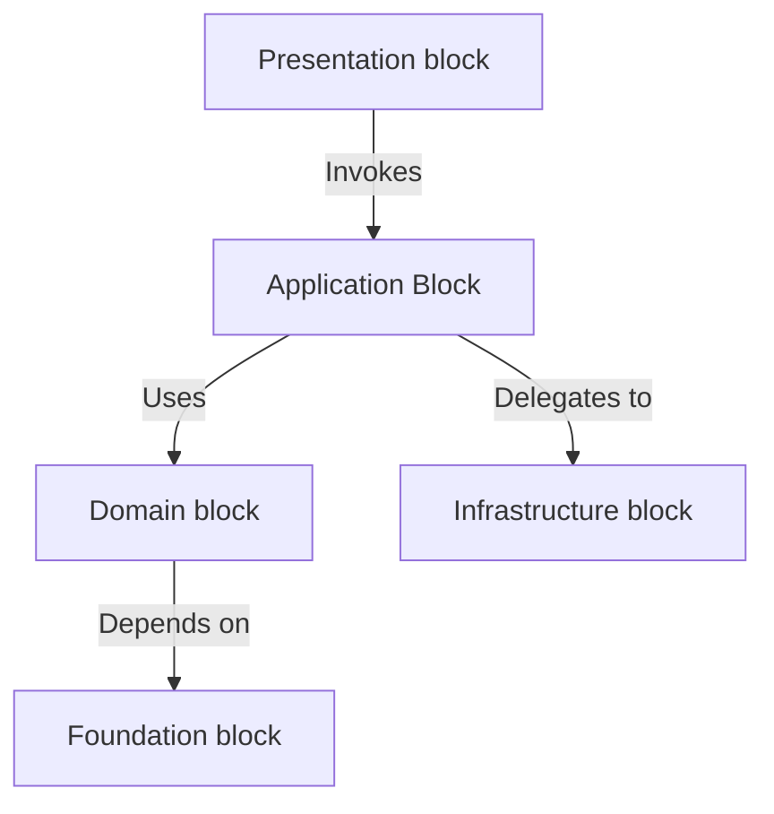
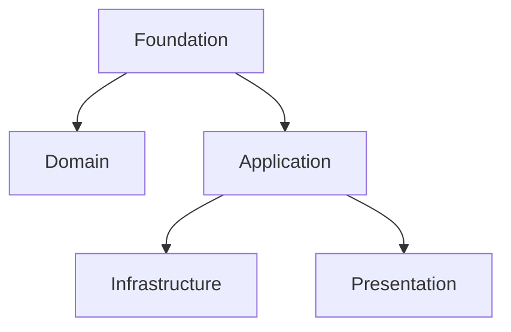
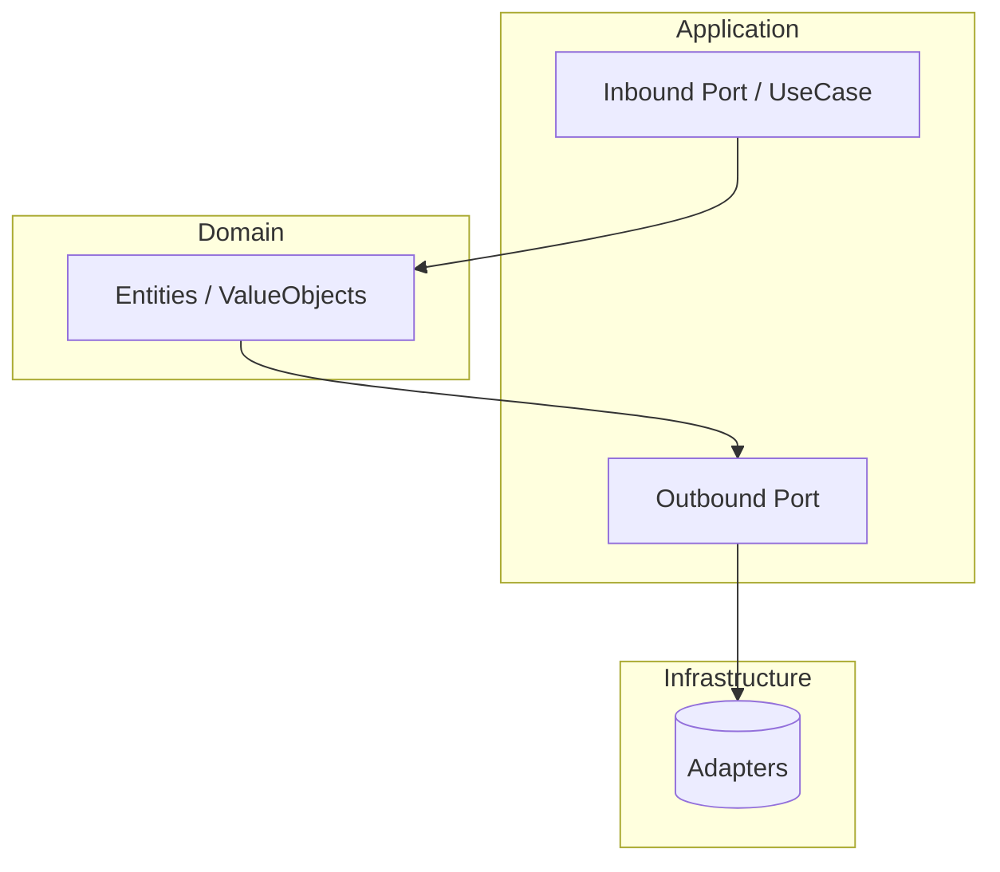

# Recommended Blocks Structure 🧩

**ForgingBlocks** organizes your code into *blocked blocks* that make large systems easier to reason about, test, and extend.

Each block has a clear responsibility and communicates with others through **explicit boundaries (Ports)**.

---

## 🧱 The Big Picture

> “Good architecture is about knowing where things belong.”

**ForgingBlocks** follows a blocked architecture model:

- each block represents a *boundary of responsibility*.
## 🏗️ Organizational Blocks

Each block represents a **boundary of responsibility**.

ForgingBlocks provides abstractions that help you keep these boundaries clear and well-defined.

- The **Foundation** block provides the core building blocks reused across the system.
- The **Domain** block contains the business rules and domain types.
- The **Application** block defines use cases and orchestrates application logic.
- The **Infrastructure** block implements external system adapters.
- The **Presentation** block contains the entry points to your system.

---

## 📦 Blocks Overview

| Block | Responsibility | Depends On |
|----------|----------------|------------|
| `foundation` | Core abstractions (`Result`, `Port`, `Mapper`) | None |
| `domain` | Business rules, Entities, Value Objects, Domain Events | Foundation |
| `application` | Ports and orchestration logic | Domain, Foundation |
| `infrastructure` | Technical adapters (DB, message brokers, APIs) | Application, Domain |
| `presentation` | Entry points (API, CLI, UI) | Application |

---

## 🧩 Blocks in Detail

### 1. **Foundation Block**

**Purpose:**

Defines reusable, *block-agnostic abstractions* that enforce consistency and composability.

**Includes:**

- `Result`, `Ok`, `Err` → explicit success/failure semantics
- `Port`, `InboundPort`, `OutboundPort` → define boundaries
- `Mapper` → safe data transformations
- `Immutable` → enforce immutability for Entities and Value Objects

**Usage:**

Imported by all other blocks; has **no dependencies** on any domain logic.

---

### 2. **Domain Block**

**Purpose:**

Encapsulates the *business rules* and *ubiquitous language* of your system.

**Includes:**

- `Entity` — uniquely identifiable object
- `ValueObject` — equality by value
- `AggregateRoot` — transactional boundary
- `DomainEvent` — explicit business occurrences

**Usage:**

Pure logic, no infrastructure dependencies.

This is the **heart of the system** — everything else exists to support it.

---

### 3. **Application Block**

**Purpose:**

Coordinates behavior between the **Domain** and the outside world using *ports and services*.

**Includes:**

- **Inbound Ports** — define use cases (`RegisterUserUseCase`, `ProcessOrderUseCase`)
- **Outbound Ports** — define external dependencies (`Repository`, `EventPublisher`, `MessageBus`)
- **Services** — orchestrate domain logic via these ports

**Usage:**

- Implements business *processes*, not business *rules*.
- No direct database, HTTP, or framework code — only contracts.

---

### 4. **Infrastructure Block**

**Purpose:**

Implements the *technical details* that fulfill the application’s outbound contracts.

**Includes:**

- Repository adapters (SQLAlchemy, Mongo, In-Memory)
- Message/Event Bus implementations (RabbitMQ, Redis, etc.)
- External API clients and persistence blocks

**Usage:**

Provides real implementations for the ports defined in the application block.
You can replace or mock these components without changing your core logic.

---

### 5. **Presentation Block**

**Purpose:**

Handles all **inbound interactions** — user requests, CLI commands, or external events.

**Includes:**

- REST or GraphQL controllers (FastAPI, Django, etc.)
- CLI interfaces (Click, Typer)
- Event consumers (Kafka, RabbitMQ listeners)

**Usage:**

Translates external inputs into **commands or queries** sent to the application block.

---

## 🧱 Documentation Convention

To keep your docs and code consistent:

| Term | Meaning | Example |
|------|----------|---------|
| **Block** | A directory with `__init__.py` representing a namespace or block | `foundation/`, `domain/`, `application/` |
| **Module** | A single `.py` file implementing one concept | `foundation/result.py` → *Result module* |

Use **“package”** for architectural boundaries and **“module”** for individual building blocks.

---

## 🧠 Why It Matters?

- Encourages **isolation** — blocks evolve independently.
- Simplifies **testing** — test behavior per block.
- Promotes **clarity** — intent and dependencies are visible.
- Supports **teaching** — concepts are self-contained and discoverable.

---

## ✅ Summary Rule

> **Block = boundary of responsibility**

> **Module = reusable building block inside a package**

Together, they make your architecture **composable, testable, and teachable** — one block at a time.
