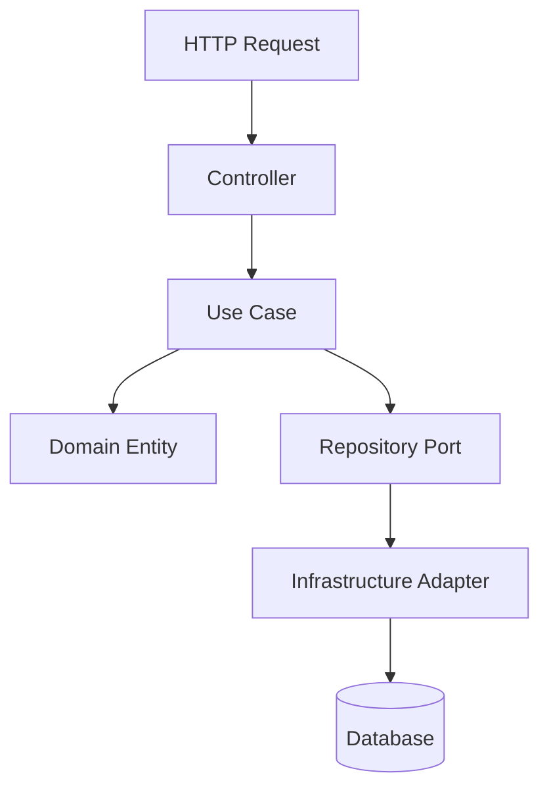
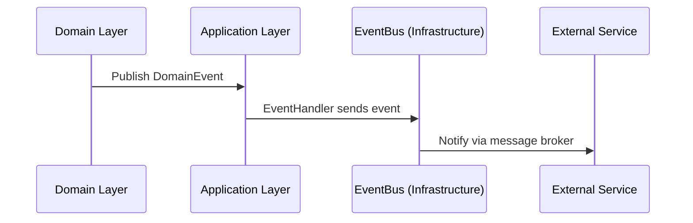
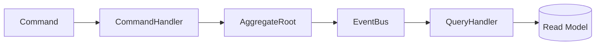

# Architecture Examples 🧩

This section illustrates how to apply **BuildingBlocks** in different contexts and architectural styles.

---

## ⚡ Example 1 — Clean Architecture (Typical Web App)



### Flow
1. The **controller** receives a request and creates a command.
2. The **application use case** executes it through an **inbound port**.
3. The use case manipulates **domain entities**.
4. It calls **outbound ports** (repositories, buses).
5. The **infrastructure layer** fulfills those ports.

---

## ⚙️ Example 2 — Event-Driven Architecture



Events decouple the system, allowing **asynchronous workflows** and **CQRS-style read models**.

---

## 🧩 Example 3 — CQRS



The **command side** updates aggregates and emits events.
The **query side** responds to read requests with dedicated data models.

---

## 🧱 Example 4 — Using Ports and Adapters

```python
# inbound port
class RegisterUserUseCase(UseCase[RegisterUserInput, Result[User, Error]]):
    ...

# outbound port
class UserRepository(Repository[User]):
    ...

# infrastructure adapter
class SqlUserRepository(UserRepository):
    ...
```

---

## ✅ Summary

These examples show that **BuildingBlocks** does not dictate the architecture — it **enables composition** across many styles (Clean, Hexagonal, CQRS, SOA, etc.).
