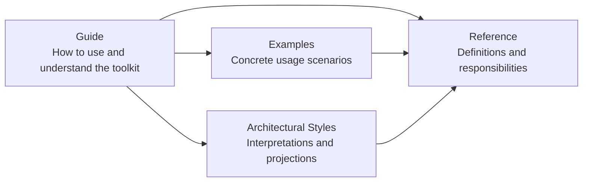

# Guide

## How to read the documentation

This documentation is organized to help you build a **clear mental model** of ForgingBlocks before diving into details.

You do not need to read everything, and you do not need to follow a strict order.
Each section is designed to stand on its own.

You can use **all** of them or only some of them.

---

## A mental model first

ForgingBlocks is built around a small set of **responsibility boundaries**.

Rather than prescribing a single architecture, the toolkit focuses on:
- Making responsibilities explicit.
- Keeping dependencies intentional.
- Supporting designs that are easy to test and evolve.

The documentation reflects this idea.

Some pages explain **what the building blocks are**.
Others show **how they can be composed**.
A few pages explore **how common architectural styles relate to these ideas**.

---

## Documentation map

The diagram below shows how the main sections of the documentation relate to each other.
It is meant as an orientation aid, not as a workflow.

---

## Suggested learning paths

There is no required order.
If you prefer a guided path, the following sequences work well.

### Minimal path

1. **Getting Started** – A small, complete example introducing the core ideas.
2. **Testing** – How clear boundaries lead to testable designs.
3. **Examples** – Focused usage scenarios you can explore independently.

### Deeper understanding

1. **Principles** – The design values and mindset behind the toolkit.
2. **Recommended Blocks Structure** – Guidance for organizing larger systems.
3. **Example Tests** – More complete test-oriented examples.
4. **Release Guide** – Notes on packaging and releasing projects.

These paths are suggestions only.
You can move freely between sections.

---

## About the Reference section

The **Reference** section defines the **meaning and responsibility** of each block:
Domain, Application, Infrastructure, Presentation, and Foundation.

These pages are intentionally precise and definition-oriented.
They are meant to be consulted as needed, not necessarily read linearly.

When terminology matters, the Reference section is the **source of truth**.

---

## About Architectural Styles

The **Architectural Styles** section describes how well-known styles—such as Clean Architecture, Hexagonal Architecture, CQRS, or Event-Driven Architecture—can be **interpreted using ForgingBlocks concepts**.

These pages are:

- Optional.
- Non-prescriptive.
- Independent from the core toolkit.

You do **not** need to adopt any architectural style to use ForgingBlocks successfully.

They are provided as learning aids, not as requirements.

---

## In short

- Start where it feels useful.
- Treat examples as guidance, not templates.
- Use the Reference when you need clarity.
- Explore Architectural Styles only if they help your understanding.

The goal of this documentation is not to tell you *what architecture to use*,
but to help you make **intentional design decisions**.
