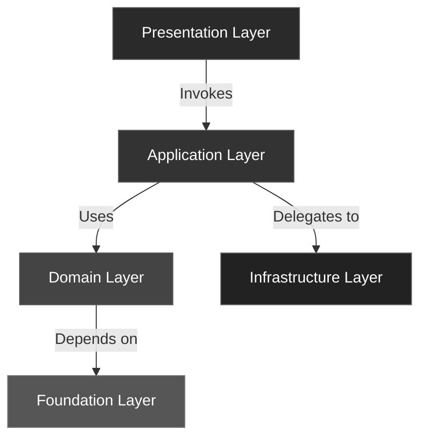
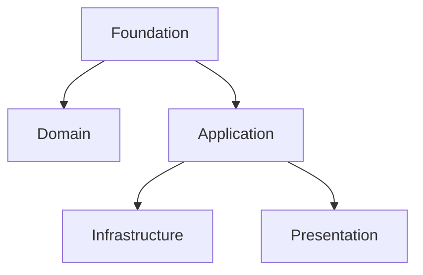
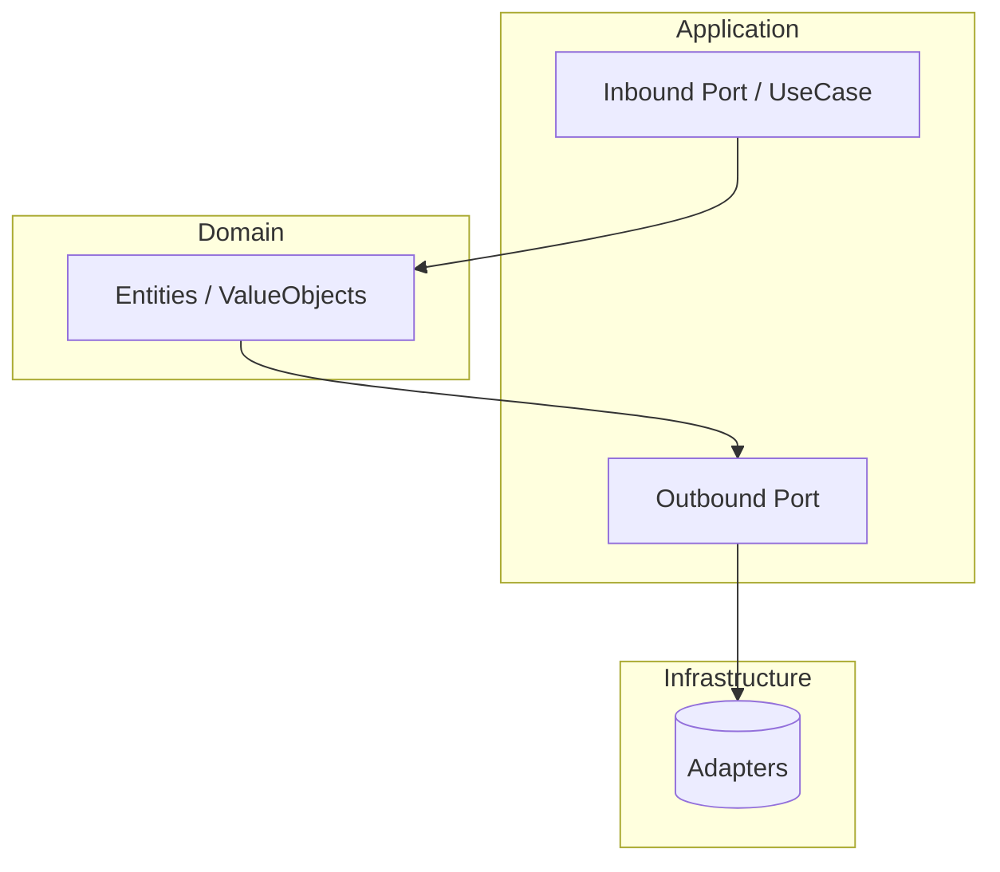

# Packages and Layers 🧩

**BuildingBlocks** organizes your code into *layered packages* that make large systems easier to reason about, test, and extend.
Each package has a clear responsibility and communicates with others through **explicit boundaries (Ports)**.

---

## 🧱 The Big Picture

> “Good architecture is about knowing where things belong.”

**BuildingBlocks** follows a layered architecture model:
each package represents a *boundary of responsibility*.

---

## 📦 Packages Overview

| Package | Responsibility | Depends On |
|----------|----------------|------------|
| `foundation` | Core abstractions (`Result`, `Port`, `Mapper`) | None |
| `domain` | Business rules, Entities, Value Objects, Domain Events | Foundation |
| `application` | Use cases and orchestration logic | Domain, Foundation |
| `infrastructure` | Technical adapters (DB, message brokers, APIs) | Application, Domain |
| `presentation` | Entry points (API, CLI, UI) | Application |

---

## 🧩 Packages in Detail

### 1. **Foundation Package**

**Purpose:**
Defines reusable, *layer-agnostic abstractions* that enforce consistency and composability.

**Includes:**
- `Result`, `Ok`, `Err` → explicit success/failure semantics
- `Port`, `InboundPort`, `OutboundPort` → define boundaries
- `Mapper` → safe data transformations
- `Immutable` → enforce immutability for Entities and Value Objects

**Usage:**
Imported by all other layers; has **no dependencies** on any domain logic.

---

### 2. **Domain Package**

**Purpose:**
Encapsulates the *business rules* and *ubiquitous language* of your system.

**Includes:**
- `Entity` — uniquely identifiable object
- `ValueObject` — equality by value
- `AggregateRoot` — transactional boundary
- `DomainEvent` — explicit business occurrences

**Usage:**
Pure logic, no infrastructure dependencies.
This is the **heart of the system** — everything else exists to support it.

---

### 3. **Application Package**

**Purpose:**
Coordinates behavior between the **Domain** and the outside world using *ports and services*.

**Includes:**
- **Inbound Ports** — define use cases (`RegisterUserUseCase`, `ProcessOrderUseCase`)
- **Outbound Ports** — define external dependencies (`Repository`, `EventPublisher`, `MessageBus`)
- **Services** — orchestrate domain logic via these ports

**Usage:**
Implements business *processes*, not business *rules*.
No direct database, HTTP, or framework code — only contracts.

---

### 4. **Infrastructure Package**

**Purpose:**
Implements the *technical details* that fulfill the application’s outbound contracts.

**Includes:**
- Repository adapters (SQLAlchemy, Mongo, In-Memory)
- Message/Event Bus implementations (RabbitMQ, Redis, etc.)
- External API clients and persistence layers

**Usage:**
Provides real implementations for the abstract ports defined in the application layer.
You can replace or mock these components without changing your core logic.

---

### 5. **Presentation Package**

**Purpose:**
Handles all **inbound interactions** — user requests, CLI commands, or external events.

**Includes:**
- REST or GraphQL controllers (FastAPI, Django, etc.)
- CLI interfaces (Click, Typer)
- Event consumers (Kafka, RabbitMQ listeners)

**Usage:**
Translates external inputs into **commands or queries** sent to the application layer.

---

## 🧱 Documentation Convention

To keep your docs and code consistent:

| Term | Meaning | Example |
|------|----------|---------|
| **Package** | A directory with `__init__.py` representing a namespace or layer | `foundation/`, `domain/`, `application/` |
| **Module** | A single `.py` file implementing one concept | `foundation/result.py` → *Result module* |

Use **“package”** for architectural boundaries and **“module”** for individual building blocks.

---

## 🧠 Why It Matters

- Encourages **isolation** — layers evolve independently.
- Simplifies **testing** — test behavior per layer.
- Promotes **clarity** — intent and dependencies are visible.
- Supports **teaching** — concepts are self-contained and discoverable.

---

## ✅ Summary Rule

> **Package = boundary of responsibility**
> **Module = reusable building block inside a package**

Together, they make your architecture **composable, testable, and teachable** — one layer at a time.
