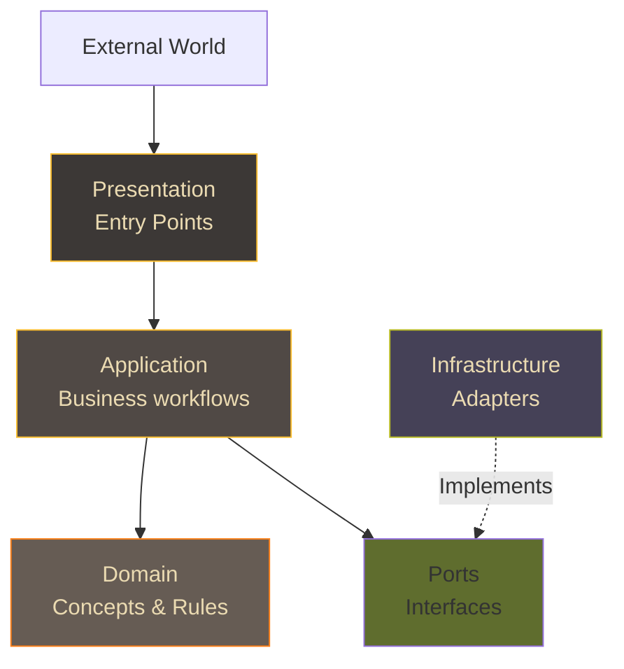

# Principles
## The mindset behind ForgingBlocks

ForgingBlocks is designed around a set of practical principles that help teams write code that is easy to **understand**, **change**, and **test** over time.

These principles are **architecture-neutral**.

You can apply them whether your project is:

- Small
- Large
- Monolithic
- Distributed
- Layered

or none of the above.

---

## 1. Clarity over cleverness

Readable code wins in the long run.

- Names should express **intent**, not implementation details.
- Types and contracts should reveal how to use something safely.
- Error paths should be visible and explicit.

ForgingBlocks encourages this by giving you explicit `Result` types, clear port contracts, and small building blocks instead of complex inheritance or magic.

---

## 2. Boundaries as first-class concepts

Large systems remain understandable when their **boundaries** are clear.

Boundaries answer questions like:

- “Who is allowed to talk to whom?”
- “Where does this external dependency touch my system?”
- “Which part of the code is responsible for this decision?”

ForgingBlocks uses **Ports** (interfaces), **blocks** (logical groupings), and explicit contracts to make these boundaries visible.

The solid arrows show call flow.

The dotted arrow shows that Infrastructure implements Port interfaces, keeping Application decoupled from technical details.

---

## 3. Explicit outcomes

Hidden failures and implicit control flow make systems fragile.

With `Result`, you can model outcomes directly:

- `Ok(value)` – successful operation with a value.
- `Err(error)` – operation that failed with an explanation.

This encourages calling code to handle both cases intentionally and avoids “surprise” exceptions flowing through call stacks.

!!! note "Inpiration for Result"
    The `Result` type is inspired by similar constructs in languages like Rust, Haskell, and Scala.

    Rust contains a built-in `Result` type to make success and failure explicit.
    Haskell and Scala contains `Either` type to make success and failure explicit.

---

## 4. Decoupling from tools

Frameworks, ORMs, and infrastructure libraries change frequently.
Core domain rules usually change more slowly.

ForgingBlocks helps you:

- Express core behavior **without** coupling it to databases, HTTP frameworks, or queues,
- Keep external concerns inside **Infrastructure** and **Presentation** blocks,
- Depend on **ports and protocols**, not concrete implementations.

This does not forbid you from using any tool. It simply keeps your options open.

---

## 5. Small, composable abstractions

Instead of large base classes or deep hierarchies, ForgingBlocks favors:

- Small protocols
- Focused types
- Composition using `Result` and mappers

You can adopt a single abstraction (for example `Result`) without adopting the rest of the toolkit. There is no “all or nothing” requirement.

---

## 6. Teachable by design

The toolkit is intentionally designed to be **teachable**:

- Concepts are separated and named.
- Examples are small and focused.
- Blocks describe responsibilities in plain language.

The goal is that a junior engineer can read the Guide and understand:

- How to express a boundary,
- How to model an outcome,
- How to organize code so it remains understandable.

Senior engineers can then use these same concepts to shape larger designs or introduce specific architectural styles if they choose to.

---

## 7. Respecting existing ideas, without enforcing them

Words like “Domain” are influenced by ideas from **Domain-Driven Design (DDD)**, and terms like “Port” appear in several architectural styles.

ForgingBlocks acknowledges this history, but it does **not** attempt to implement or enforce DDD, Hexagonal Architecture, or any other style.

You can use those styles if they help your project, but they are always **optional**.
