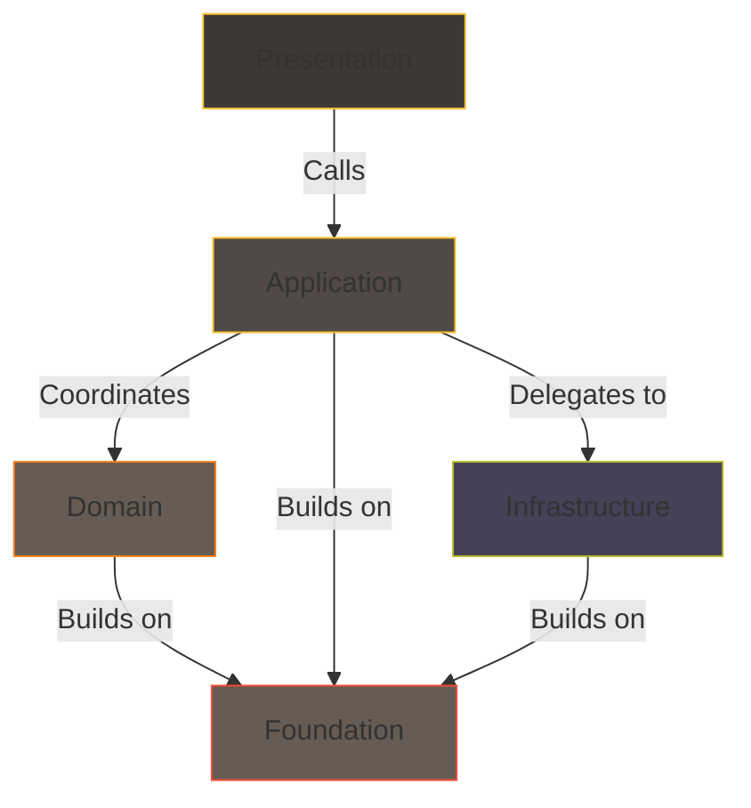

# Recommended Blocks Structure
## Thinking in responsibilities and boundaries

This section explains a **practical way** to organize code using blocks.
It is a recommendation, not a rule: you can use all of these blocks, some of them, or even create your own.

A **block** is simply a group of code that shares a responsibility and a boundary.

---

## Overview of the blocks

The common blocks are:

- **Foundation** – reusable, low-level abstractions.
- **Domain** – problem-space concepts and rules.
- **Application** – business workflows and coordination logic.
- **Infrastructure** – technical adapters to external systems.
- **Presentation** – entry points and interaction boundaries.

This diagram is **illustrative**, not prescriptive.
It helps visualize how responsibilities can be separated.

---

## Block vs Layer

In ForgingBlocks, a **block** is an architecture-neutral concept.

You may interpret a block as a “layer” if that mental model helps, especially when you compare to literature on layered architectures or clean architecture.

However, the toolkit does **not** require or enforce any specific layering scheme.

Think of blocks as **named boundaries** that you are free to use or ignore depending on the needs of your project.

!!! note "Dependency Rules"
    The recommended dependency rules are:

    - Foundation has no dependencies.
    - Domain depends only on Foundation.
    - Application depends on Domain and Foundation.
    - Infrastructure depends on Application (for OutboundPorts) and Foundation.
    - Presentation depends on Application and Foundation.

    These rules help maintain clear boundaries and promote decoupling between blocks.

---

## Foundation

**Responsibility:** provide small, reusable building blocks.

Examples:

- `Result`, `Ok`, `Err`
- `Port` and port-related protocols
- `Mapper` for structured transformation
- `ResultMapper` for transforming Results
- `Debuggable` protocol for consistent debug representations

The Foundation block contains abstractions that support the other blocks.

!!! note "Purpose of Foundation block"
    That Foundation block exists to provide shared abstractions.
    That block defines the core building blocks that other blocks can rely on.

It can be reused across many blocks.

---

## Domain

**Responsibility:** describe what the system is about.

Examples:

- **Types** that represent meaningful concepts (orders, tasks, users…)
- **Rules** and invariants that keep those concepts valid
- **Optional** domain events for significant occurrences

This block knows nothing about HTTP, SQL, queues, filesystems or any technical details.

!!! note "Meaning of Domain"
    In **Psychology**, a *domain* is simply an area of knowledge or activity.

    In ForgingBlocks, the **Domain** represents the **problem space** your system is concerned with — the concepts and rules that describe *what* the system is about, not *how* it is implemented.

!!! note "Dependency rule"
    The Domain depends only on **Foundation**.

    It must not depend on Application, Infrastructure, or Presentation, so that the core logic remains independent of technical concerns.

---

## Application

**Responsibility:** orchestrate business workflows by coordinating Domain logic and Infrastructure through ports.

Examples:

- InboundPorts representing business operations that the system offers
- OutboundPorts representing external dependencies needed by the system
- Workflow implementations (e.g. `RegisterUser`, `CreateTask`)
- Application services that implement coordination logic, calling domain methods and OutboundPorts

The Application block uses Domain models and calls Infrastructure through **OutboundPorts**, but does not contain technical implementation details.

!!! note "Dependency rule"
    Application depends on Domain and Foundation.
    It defines both InboundPort and OutboundPort interfaces.
    Infrastructure implements the OutboundPort interfaces (Dependency Inversion Principle).

---

## Infrastructure

**Responsibility:** connect the system to external technologies.

Examples:

- Concrete repositories (SQL, NoSQL, in-memory)
- Messaging and event bus integrations
- HTTP clients for external APIs

Infrastructure implements OutboundPort interfaces defined by Application or Domain.

!!! note "Dependency Rule"
    Infrastructure depends on OutboundPorts and Foundation block.
    External dependencies are allowed here.
    This is where databases, network calls, and any other external concerns lives.

---

## Presentation

**Responsibility:** expose the system to the outside world.

Examples:

- HTTP controllers or routers
- CLI commands
- message consumers or event handlers

Presentation reads external input, prepares it, and calls the Application block.
It stays as thin as possible so that the behavior remains testable and reusable.
