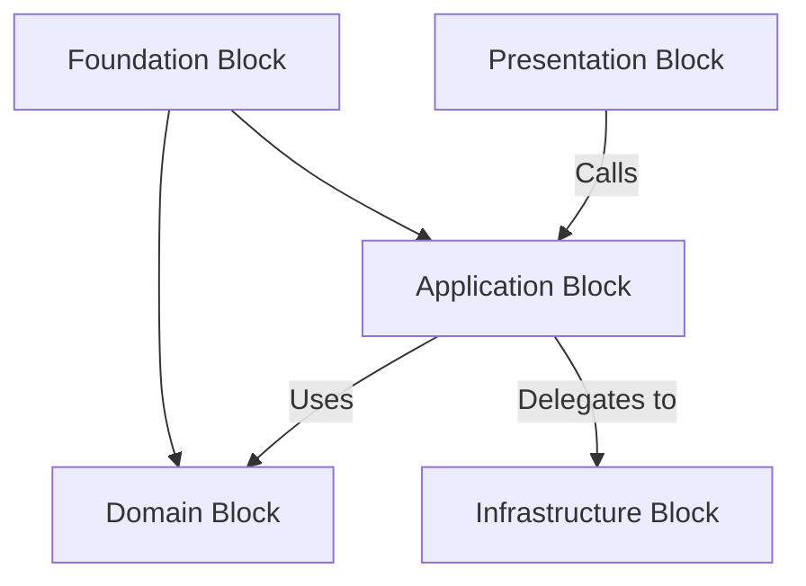

# Recommended Blocks Structure 🧩

**ForgingBlocks** provides a set of organizational blocks you can use to structure large systems in a clear, discoverable, and maintainable way. These blocks are optional — they offer guidance, not enforcement. You may adopt some or all of them depending on your project’s goals.

Each block represents a boundary of responsibility, allowing you to separate concerns in a way that matches your system’s needs.

---

## 🏗️ Organizational Blocks

Each block represents a **boundary of responsibility**.

ForgingBlocks provides small abstractions that help you keep these boundaries intentional and easy to understand.

- The **Foundation** block offers the core building blocks reused throughout the system.
- The **Domain** block defines the concepts and rules that model your problem space.
- The **Application** block expresses use cases and coordinates domain behavior.
- The **Infrastructure** block supplies adapters to external systems.
- The **Presentation** block handles incoming interactions with your application.

!!! abstract "Block vs Layer"
    In ForgingBlocks, the term *block* is intentionally architecture-neutral.
    You may interpret a block as a *layer* if that mental model helps, but this toolkit does not require or enforce any structural pattern.

---

## 📦 Blocks Overview

| Block | Responsibility | Typical Interactions |
|-------|----------------|-----------------------|
| `foundation` | Core abstractions, foundational contracts, Result types, Ports, Mappers | Used by any other block |
| `domain` | Domain building blocks and rules that model your problem space | Uses `foundation` |
| `application` | Use cases and coordination of domain behavior | Uses `domain` and `foundation` |
| `infrastructure` | Adapters to external systems and technical details | Fulfills contracts defined in `application` |
| `presentation` | Entry points such as APIs, CLIs, or event handlers | Delegates to `application` |

---

## 🔍 Example Block Interaction

This is a conceptual view, not a rule. You can adapt it to the needs of your project.

---

## 🧩 Using Blocks in Practice

You might start with:

- `foundation` for `Result`, `Port`, and helpers.
- `domain` for entities, value-like objects, and rules.
- `application` for use case coordination.

Over time you can introduce `infrastructure` and `presentation` when and if they add clarity.

ForgingBlocks does not require you to adopt all blocks — treat them as vocabulary you can reach for when it helps.
