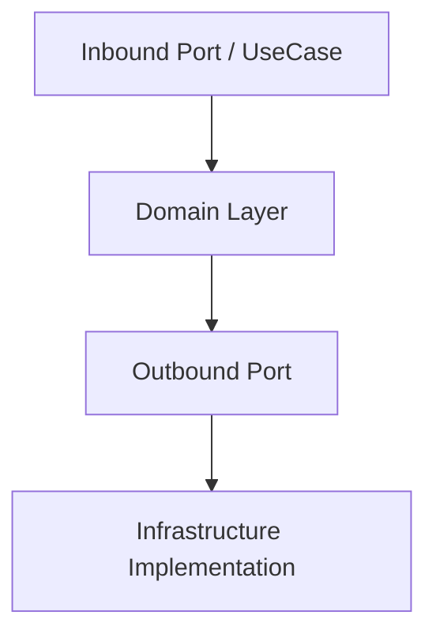

# Application Package ⚙️

The **application** package defines how the system behaves — it orchestrates domain logic through **inbound** and **outbound ports**.

---

## 🧠 Purpose

This layer expresses *what the system does* — coordinating the domain with the outside world through explicit boundaries.

- **Inbound Ports** define *use cases* (entry points).

- **Outbound Ports** define *dependencies* (repositories, message buses, etc.).

---

## 🧩 Structure

```
application/
├── ports/
│   ├── inbound/
│   │   ├── <action>_use_case.py
│   │   └── <action>_service.py
│   └── outbound/
│       ├── <entity>_repository.py
│       ├── event_publisher.py
│       ├── command_sender.py
│       ├── query_fetcher.py
│       └── message_bus.py
└── services/
```

---

## ⚙️ Inbound Ports

Inbound ports define *use cases* (application entry points).

Each `<action>_use_case.py` file defines a protocol for a specific action.

```python
from dataclasses import dataclass

from buildingblocks.application import UseCase

@dataclass(frozen=True)
class RegisterUserRequest:
    username: str
    email: str
    password: str

@dataclass(frozen=True)
class RegisterUserResponse:
    user_id: str

@dataclass(frozen=True)
class RegisterUserError:
    reason: str

RegisterUserResult = Result[RegisterUserResponse, RegisterUserError]

class RegisterUserUseCase(UseCase[RegisterUserRequest, RegisterUserResult], Protocol):
    async def execute(self, request: RegisterUserDTO) -> RegisterUserResult:
        ...
```

Their concrete implementations (e.g., `RegisterUserService`) live in `application/services/`.

---

## ⚙️ Outbound Ports

Outbound ports define *external dependencies* that the application interacts with.

### Repositories

```python
from uuid import UUID

from buildingblocks.application import Repository
from buildingblocks.domain import Entity

class User(Entity):
    id: UUID
    username: str
    email: str

class UserRepository(Repository[User, UUID], Protocol):
    async def delete_by_id(self, user_id: UUID) -> None: ...
        ...

    async def get_by_id(self, user_id: UUID) -> User | None:
        ...

    async def list_all(self) -> list[User]:
        ...

    async def save(self, user: User) -> None:
        ...
```

And will be implemented in the infrastructure layer.

That isolates data access logic from the application.

### Event Publisher

```python
class EventPublisher(Protocol):
    def __init__(self, message_bus: MessageBus) -> None:
        self._message_bus = message_bus

    async def publish(self, event: Event) -> None:
        """Publish an event synchronously.

        Args:
            event: The domain event to be published.
        """
        await self._message_bus.dispatch(event)
```

This toolkit already provides it implemeneted for common message buses.

### Message Bus and Dispatcher

```python
class MessageBus(Protocol, Generic[MessageBusResponse]):
    """Asynchronous outbound port for a message bus."""

    async def dispatch(self, message: Message) -> TResponse:
        """Dispatch a message asynchronously."""
        ...

    async def register_handler(self, handler: MessageHandler) -> None:
        """Register a message handler asynchronously."""
        ...
```

But you should be implemented for you and integrated with your messaging technology in the  `infrastructure` layer.

---

## 🧩 Diagram



---

## 🧭 Cross-links

- See also: [Domain Layer](domain.md) — entities and rules.
- See also: [Infrastructure Layer](infrastructure.md) — implementations of outbound ports.

---

## ✅ Summary

| Aspect | Description |
|--------|--------------|
| **Responsibility** | Orchestrate domain logic through explicit ports |
| **Depends on** | Domain, Foundation |
| **Used by** | Infrastructure, Presentation |
| **Should not depend on** | Frameworks |
