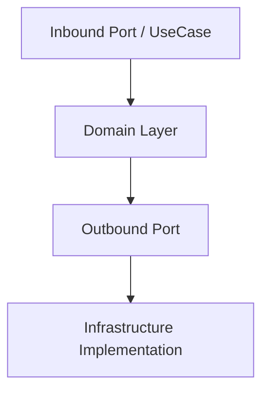

# Application Package ⚙️

The **application** package defines how the system behaves — it orchestrates domain logic through **inbound** and **outbound ports**.

---

## 🧠 Purpose

This layer expresses *what the system does* — coordinating the domain with the outside world through explicit boundaries.

- **Inbound Ports** define *use cases* (entry points).
- **Outbound Ports** define *dependencies* (repositories, message buses, etc.).

---

## 🧩 Structure

```
application/
├── ports/
│   ├── inbound/
│   │   ├── <action>_use_case.py
│   │   └── <action>_service.py
│   └── outbound/
│       ├── <entity>_repository.py
│       ├── event_publisher.py
│       ├── command_sender.py
│       ├── query_fetcher.py
│       └── message_bus.py
└── services/
```

---

## ⚙️ Inbound Ports

Inbound ports define *use cases* (application entry points).
Each `<action>_use_case.py` file defines a protocol for a specific action.

```python
class RegisterUserUseCase(Protocol):
    async def execute(self, data: RegisterUserDTO) -> Result[User, Error]: ...
```

Their concrete implementations (e.g., `RegisterUserService`) live in `application/services/`.

---

## ⚙️ Outbound Ports

Outbound ports define *external dependencies* that the application interacts with.

### Repositories

```python
class UserRepository(Protocol):
    async def save(self, user: User) -> None: ...
```

### Event Publisher

```python
class EventPublisher(Protocol):
    async def publish(self, event: DomainEvent) -> None: ...
```

Implemented using composition — typically consuming a `MessageDispatcher` or `MessageBus`.

### Message Bus and Dispatcher

```python
class MessageBus(Protocol):
    async def dispatch(self, message: Message) -> None: ...
    async def listen(self, topic: str) -> None: ...
```

---

## 🧩 Diagram



---

## 🧭 Cross-links

- See also: [Domain Layer](domain.md) — entities and rules.
- See also: [Infrastructure Layer](infrastructure.md) — implementations of outbound ports.

---

## ✅ Summary

| Aspect | Description |
|--------|--------------|
| **Responsibility** | Orchestrate domain logic through explicit ports |
| **Depends on** | Domain, Foundation |
| **Used by** | Infrastructure, Presentation |
| **Should not depend on** | Frameworks |
