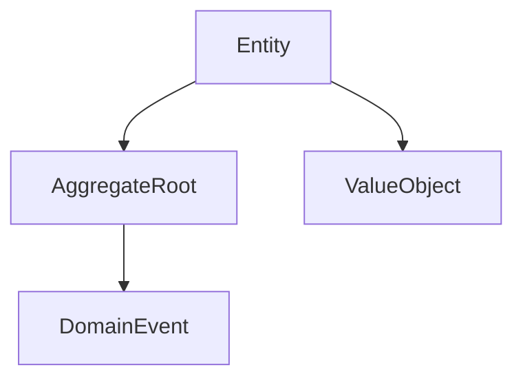

# Domain Package 🏛️

The **domain** package defines the *core business rules* and *ubiquitous language* of your system.
It expresses *what the system is* — not *what it does*.

---

## 🧩 Purpose

The domain layer is the **heart of your application**.
It models behavior through **Entities**, **Value Objects**, and **Aggregate Roots**.

---

## ⚙️ Core Components

### ValueObject

An immutable object defined by its attributes, not identity.

```python
class Coordinate(ValueObject):
    x: float
    y: float
```

### Entity

An object with a unique identity that encapsulates behavior and state.

```python
class User(Entity):
    id: UUID
    name: str
```

### AggregateRoot

A cluster of entities treated as a single unit of consistency.

```python
class Order(AggregateRoot):
    id: UUID
    items: list[OrderItem]

    def add_item(self, item: OrderItem) -> None:
        self.items.append(item)
```

---

## 🧩 Diagram



---

## 🧭 Cross-links

- See also: [Application Layer](application.md) — orchestrates domain operations.
- See also: [Foundation Layer](foundation.md) — provides base contracts like `Result` and `Port`.

---

## ✅ Summary

| Aspect | Description |
|--------|--------------|
| **Responsibility** | Express and enforce business rules |
| **Depends on** | Foundation |
| **Used by** | Application, Infrastructure |
| **Should not depend on** | Infrastructure, Presentation |
