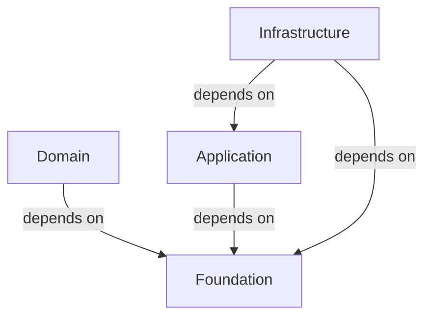

# Foundation
## Foundational abstractions and contracts

The **Foundation** block provides low-level, reusable abstractions that are shared
across the entire system.

It contains **no domain logic**, **no application orchestration**, and
**no infrastructure concerns**.

Foundation exists to define **stable contracts and primitives** on top of which
all other blocks are built.

---

## Purpose

- Supply **primitive abstractions** (`Result`, `Port`, `Mapper`).
- Enable explicit, intention-revealing boundaries.
- Support structured and predictable error handling.
- Provide a stable base reused by all other blocks.

---

## Dependency position

Foundation depends on nothing.
All other blocks may depend on Foundation.

---

## Core concepts

### Result

`Result` models the **explicit outcome** of an operation.

It is used when failure is part of normal behavior, such as:

- validation
- parsing
- rule evaluation
- boundary checks

A `Result` represents either success (`Ok`) or failure (`Err`), without relying on
exceptions for control flow.

Result is about **flow**, not about error representation.

---

### Errors

Foundation defines a structured **error model**.

Errors represent **what went wrong**, not **how control flows**.

They are:

- structured objects (message + metadata)
- debuggable
- composable and aggregatable
- usable both as return values and raised exceptions

Errors are commonly carried inside `Err`, but the two concepts are distinct:

- `Result` answers *whether* an operation succeeded.
- `Error` answers *why* it failed.

Foundation provides reusable error categories such as:

- validation errors
- rule violation errors
- structural or invariant errors

These error types are architecture-neutral and reusable across domains.

---

### Port

A `Port` represents a **boundary between components**.

Ports define *what is expected*, not *how it is implemented*.
They enable replacement, testing, and decoupling without imposing an architecture.

---

### Mapper

`Mapper` and `ResultMapper` define **explicit transformations** between types.

They make data conversion intentional and observable,
avoiding hidden or implicit mappings.

---

### Debuggable

`Debuggable` is a lightweight contract for exposing structured debug information.

It enables introspection without leaking internal state or implementation details.

---

## Characteristics

- Pure Python (standard library only).
- Architecture-neutral.
- Stable, low-level abstractions.
- Used by all other blocks.
