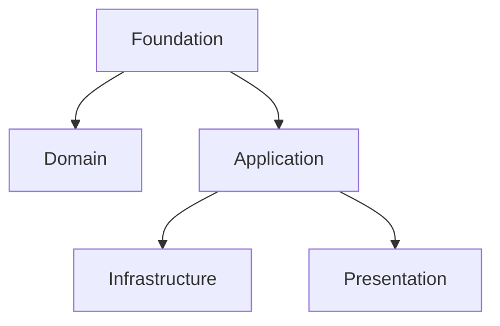

# Foundation Package 🧩

The **foundation** package defines the core abstractions that the rest of the toolkit depends on.
It provides *reusable contracts* — small, composable building blocks that enforce clarity and explicit boundaries.

---

## 🧠 Purpose

The foundation layer defines **layer-agnostic** interfaces and helpers that can be reused anywhere.
It contains no business logic or framework dependencies.

---

## ⚙️ Components

### Result

Represents success or failure explicitly without exceptions.

```python
from building_blocks.foundation import Result, Ok, Err

def divide(a: int, b: int) -> Result[int, str]:
    if b == 0:
        return Err("division by zero")
    return Ok(a // b)
```

### Port

The base abstraction for communication boundaries between layers.

```python
class Port(Generic[InputType, OutputType], Protocol):
    def execute(self, data: InputType) -> OutputType: ...
```

### Mapper

Defines safe type transformations between layers.

### Event Bus

Defines contracts for publishing and handling events.

### Immutable

Mixin and decorators that make entities and value objects immutable.

---

## 🧭 Cross-links

- See also: [Domain Layer](domain.md) for business rules.
- See also: [Application Layer](application.md) for orchestration logic.

---

## 🧩 Diagram



---

## ✅ Summary

| Aspect | Description |
|--------|--------------|
| **Responsibility** | Define reusable abstractions and contracts |
| **Depends on** | None |
| **Used by** | All layers |
| **Should not depend on** | Domain, Application, Infrastructure, Presentation |
