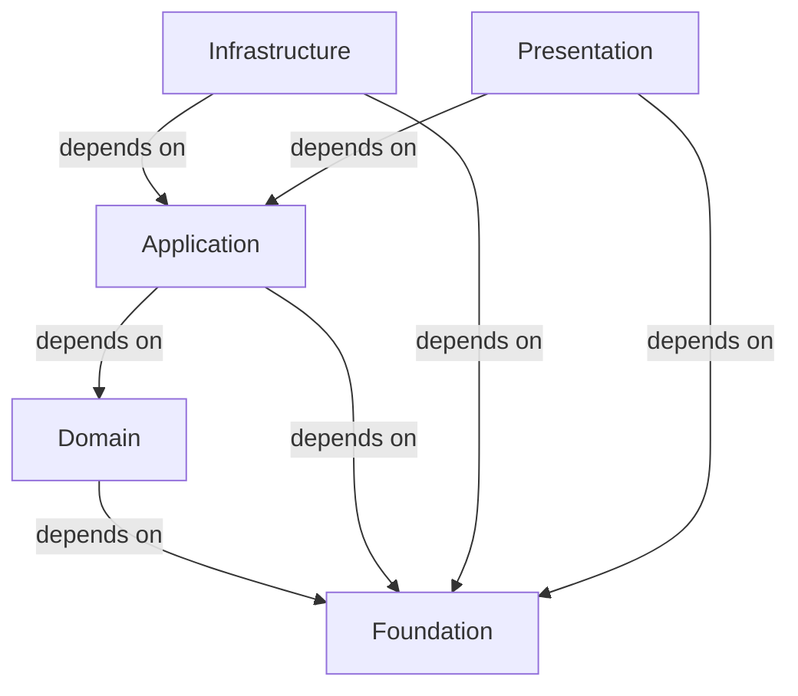

# Foundation
## Foundational abstractions and contracts

The **Foundation** block provides low-level, reusable abstractions that are shared
across the entire system.

It contains **no domain logic**, **no application orchestration**, and
**no infrastructure concerns**.

---
## Quick summary

The **Foundation** block provides low-level, reusable abstractions shared across the entire system. It contains **no domain logic, no application orchestration, and no infrastructure concerns** — only stable contracts and primitives.

Key abstractions:
- **Result** — Explicit outcomes (Ok/Err) without exceptions for control flow
- **Port** — Boundaries between components (what is expected, not how implemented)
- **Mapper** — Explicit transformations between types
- **ValueObject** — Immutable, value-based equality objects
- **Auto-freeze** — Automatic immutability after `__init__`
- **Identified** — Protocol for objects carrying an identifier
- **Messages** — Command, Event, Query (immutable, architecture-neutral)
- **Message dataclass decorator** — Boilerplate-free message definitions with automatic serialization support
- **Specification** — Composable predicates over candidate objects (and/or/not composition)
- **Errors** — Structured error model (message + metadata)
- **Meta utilities** — Runtime enforcement (runtime_final, runtime_sealed, runtime_abstract)

Foundation depends on nothing; all other blocks depend on Foundation.

---
## Purpose

- Supply **primitive abstractions** (`Result`, `Port`, `Mapper`, `Identified`, `ValueObject`, `Message`, `Command`, `Event`, `Query`, `Specification`, plus error and meta utilities).
- Enable explicit, intention-revealing boundaries.
- Support structured and predictable error handling.
- Provide a stable base reused by all other blocks.

---

## Dependency position


```mermaid
flowchart TD
    D[Domain] -->|depends on| F[Foundation]
    A[Application] -->|depends on| F
    A -->|depends on| D
    I[Infrastructure] -->|depends on| A
    I -->|depends on| F
    P[Presentation] -->|depends on| A
    P -->|depends on| F
```

Foundation depends on nothing.
All other blocks may depend on Foundation.

---

## Core concepts

### Result

`Result` models the **explicit outcome** of an operation.

It is used when failure is part of normal behavior, such as:

- validation
- parsing
- rule evaluation
- boundary checks

A `Result` represents either success (`Ok`) or failure (`Err`), without relying on
exceptions for control flow.

Result is about **flow**, not about error representation.

In the codebase, `Result` is a `Protocol` that describes the shared shape of both
variants, while `Ok` and `Err` are the concrete implementations you actually
construct and return.

`Result` supports Python's structural pattern matching through `__match_args__`,
so you can write `match` statements directly against `Ok(...)` and `Err(...)`
patterns.

Common operations on a `Result` include:

- `is_ok` and `is_err` for branching on the variant.
- `value` and `error` for unwrapping the carried payload.
- `map` for transforming the success value while passing errors through.
- `map_error` for transforming the error while passing success through.
- `flat_map` for chaining operations that themselves return a `Result`.
- `get_value_or(default)` for supplying a fallback when the result is an error.
- `get_value_or_else(fn)` for computing a fallback from the carried error.

Accessing the wrong side of a `Result` (for example calling `.value` on an `Err`)
raises a `ResultAccessError`, making invalid access explicit and discoverable.

---

### Errors

Foundation defines a structured **error model**.

Errors represent **what went wrong**, not **how control flows**.

They are:

- structured objects (message + metadata)
- debuggable
- composable and aggregatable
- usable both as return values and raised exceptions

Errors are commonly carried inside `Err`, but the two concepts are distinct:

- `Result` answers *whether* an operation succeeded.
- `Error` answers *why* it failed.

#### Error building blocks

Foundation ships small, reusable data structures that compose the error model:

- `ErrorMessage` carries the human-readable message of an error.
- `ErrorMetadata` carries additional context as a `dict` of structured data.
- `FieldReference` identifies the field an error refers to, when applicable.

These types are intentionally minimal so that any block can build on them
without inheriting domain assumptions.

#### Base error

`Error` is the base class for all structured errors. It:

- inherits from both `Exception` and `Debuggable`, so it can be raised like a
  standard exception and inspected like a debuggable object.
- exposes `.message`, `.metadata`, and a convenience `.context` shortcut.
- provides `as_debug_string()` for rich, multi-line diagnostic output.

#### Specialized errors

Foundation provides a small set of reusable error categories that you can use
directly or extend:

- `NoneNotAllowedError` indicates that a `None` value was supplied where it
  was not allowed.
- `CantModifyImmutableAttributeError` signals an attempt to mutate an
  attribute that was meant to stay immutable, such as on a `ValueObject`.
- `ValidationError` and `ValidationFieldErrors` model input validation
  failures, optionally tied to a specific `FieldReference`.
- `RuleViolationError` and `CombinedRuleViolationErrors` model business rule
  violations, with an aggregator for collecting several at once.
- `CombinedErrors` is a generic aggregator for grouping any `Error` subclass
  under a single failure.
- `FieldErrors` is a generic base for errors associated with a specific field
  that can be iterated and counted like a collection.
- `ResultAccessError` is raised when `.value` or `.error` is read from the
  wrong side of a `Result`.
- `NotCallablePredicateError` indicates that a non-callable value was supplied
  where a callable predicate was expected, such as when constructing an
  `ExpressionSpecification`.

These error types are architecture-neutral and reusable across domains.

---

### Port

A `Port` represents a **boundary between components**.

Ports define *what is expected*, not *how it is implemented*.
They enable replacement, testing, and decoupling without imposing an architecture.

`Port` is intentionally minimal: a generic `Protocol` parameterized by an
input and output type. The concrete meaning of a port is defined by the
components that extend it.

In addition to the base `Port`, Foundation exposes two role-marking
aliases that you can use to give a boundary a more specific semantic name:

- `InboundPort` describes boundaries that **accept input** from
  the outside world.
- `OutboundPort` describes boundaries that **produce output**
  towards the outside world.

These aliases are intentionally not prescriptive.
You are free to ignore them and use only `Port`, or to invent your own naming
on top of the same generic shape.

---

### Mapper

`Mapper` defines **explicit transformations** between types.

It makes data conversion intentional and observable, avoiding hidden or
implicit mappings.

`Mapper` is a generic `Protocol` parameterized by a source type and a target
type. Variance is inferred automatically by the type checker, so the same
abstraction can be reused in a wide range of contexts.

---

### Debuggable

`Debuggable` is a lightweight contract for exposing structured debug information.

It enables introspection without leaking internal state or implementation details.

---

### ValueObject

`ValueObject` is the base class for **immutable concepts defined by their values**.

A value object:

- is identified entirely by the values of its attributes, not by a unique id.
- is **immutable** after construction: any attempt to modify an attribute after
  initialization raises a `CantModifyImmutableAttributeError`.
- is hashable, so it can be safely used as a dictionary key or set member.
- implements equality based on its `_equality_components`, which subclasses
  define.

`ValueObject` lives in Foundation because immutability and value-based
equality are generic enough to be reused outside the Domain block as well.
The Domain block simply re-exports the same class so that domain code can
import it from a natural location.

In practice, you can import `ValueObject` from either
`forging_blocks.foundation.value_object` (where the implementation lives)
or from `forging_blocks.domain.value_object` (the re-export). It is not
re-exported from the top-level `forging_blocks.foundation` namespace.

#### Why ValueObject over a frozen dataclass?

Python's `@dataclass(frozen=True)` and `ValueObject` both produce immutable
objects, but they differ in a critical way: **when immutability kicks in**.

| Mechanism | Freeze timing | Can set attrs in `__init__`? | Equality / hashing |
|---|---|---|---|
| `@dataclass(frozen=True)` | Before `__init__` runs | No - Must use `object.__setattr__` in `__post_init__` | Based on all fields (automatic) |
| `ValueObject` (`@auto_freeze`) | **After** `__init__` completes | Yes - Natural `self._x = x` works | Based on `_equality_components` (explicit, selective) |

**Frozen dataclass** prevents *all* `__setattr__` from the moment the object is
created, including inside `__init__`. Any validation or transformation during
initialization must work around this by calling `object.__setattr__`, which is
verbose and error-prone:

```python
@dataclass(frozen=True)
class Email:
    value: str

    def __post_init__(self):
        if "@" not in self.value:
            raise ValueError("Invalid email")
        # Already frozen — self.value = ... would raise FrozenInstanceError
        # Must use object.__setattr__ for any transformation:
        object.__setattr__(self, "value", self.value.lower().strip())
```

**ValueObject** keeps the instance mutable during `__init__`, so you can
validate, transform, and assign attributes naturally. Immutability is
enforced *after* construction via `@auto_freeze`:

```python
class Email(ValueObject[str]):
    __slots__ = ("_value",)

    def __init__(self, value: str) -> None:
        super().__init__()
        if "@" not in value:
            raise ValueError("Invalid email format")
        self._value = value.lower().strip()  # Natural assignment

    @property
    def value(self) -> str:
        return self._value

    @property
    def _equality_components(self) -> tuple[Hashable, ...]:
        return (self._value,)
```

Beyond timing, `ValueObject` gives you **four things for free** that a frozen
dataclass requires manual wiring for:

1. **Auto-freeze** — `@auto_freeze` is applied automatically, so every concrete
   subclass becomes immutable with zero boilerplate.
2. **Equality** — you control exactly which fields participate via
   `_equality_components`, rather than relying on all fields automatically.
3. **Hashing** — derived from the same components as equality.
4. **Domain-appropriate error** — raises `CantModifyImmutableAttributeError`
   instead of the generic `FrozenInstanceError`.

**When to use each:**

- Use `ValueObject` when you need domain semantics: selective equality,
  natural `__init__` with validation, and a domain-specific error type.
  This covers the vast majority of domain modeling.
- Use `@dataclass(frozen=True)` when you need a simple, throwaway data holder
  where all-field equality is acceptable and you don't need validation
  during construction.
- Use `@auto_freeze` directly on a dataclass or plain class when you want
  post-init immutability but don't need the value-object semantics
  (equality components, hash, etc.).

---

### Auto-freeze

`@auto_freeze` is a decorator that **automatically freezes instances after
``__init__`` completes**, enforcing immutability without requiring any
protocol methods on the decorated class. The decorator handles everything
internally: injecting a frozen state marker, wrapping ``__setattr__``, and
tracking init depth to support ``super().__init__()`` chains.

`ValueObject` uses ``@auto_freeze`` internally so that every concrete
subclass gets immutability for free. You can also apply ``@auto_freeze``
to your own classes — just decorate and write a normal ``__init__``:

```python
from forging_blocks.foundation.autofreeze import auto_freeze


@auto_freeze
class Money:
    def __init__(self, amount: int, currency: str) -> None:
        self._amount = amount
        self._currency = currency.upper()

    @property
    def amount(self) -> int:
        return self._amount

    @property
    def currency(self) -> str:
        return self._currency
```

After ``__init__`` completes, any attempt to modify an attribute raises
``CantModifyImmutableAttributeError``.

#### Selective freezing

Pass ``attrs=["_id"]`` to freeze only specific attributes while leaving
others writable. This is used by ``Entity`` to lock the identity field
while allowing other attributes to change over time:

```python
@auto_freeze(attrs=["_id"])
class User:
    def __init__(self, user_id: str, name: str) -> None:
        self._id = user_id
        self._name = name
```

#### How it works

1. **Init wrapping** — ``__init__`` is wrapped with depth tracking
   (``_autofreeze__init_depth``) so that ``super().__init__()`` chains
   freeze only when the outermost init finishes.
2. **``__setattr__`` injection** — If the class does not have a custom
   ``__setattr__``, the decorator injects one that checks the frozen
   flags before allowing writes.
3. **Markers** — ``_autofreeze__frozen`` (full freeze) or
   ``_autofreeze__frozen_attrs`` (selective freeze) are set on the
   instance after init.
4. **Abstract class skip** — Abstract classes (``inspect.isabstract``)
   are not frozen, so intermediate bases in a hierarchy can call
   ``super().__init__()`` without triggering a freeze.

#### Classes with custom ``__setattr__``

If the target class defines its own ``__setattr__`` (e.g., ``Entity``
needs custom error types like ``EntityIdModificationError``), the
decorator does **not** overwrite it. The class is responsible for
checking ``_autofreeze__frozen`` or ``_autofreeze__frozen_attrs``
itself, then calling ``object.__setattr__``:

```python
def __setattr__(self, name: str, value: Any) -> None:
    frozen_attrs = getattr(self, "_autofreeze__frozen_attrs", None)
    if frozen_attrs is not None and name in frozen_attrs:
        raise EntityIdModificationError(...)
    object.__setattr__(self, name, value)
```

Most users won't need ``@auto_freeze`` directly — extending
``ValueObject`` is the simpler path. The decorator is available for
cases where you want automatic immutability without value-object
semantics.
---

### Meta utilities

Foundation provides a small set of metaclass utilities for **runtime
enforcement of design intent**.

These tools complement static type-checker hints with checks that run
at class creation time.

- `runtime_final` is a decorator that marks a method as final at runtime.
  Any subclass that tries to override the method fails at class creation
  time, not later.
- `FinalMeta` is a metaclass that enforces `@runtime_final` declarations
  across an inheritance hierarchy.
- `FinalABCMeta` combines `FinalMeta` with `ABCMeta`, so a class can be
  both abstract and runtime-final at the same time.

These utilities are **optional**.
You can use them to express intent clearly, but you are never required
to use them in order to follow the rest of the toolkit.

---

### Identified

`Identified` is a protocol for any object that carries an identifier.

It exposes an `id` property that returns the object's identity, which may be `None` for unpersisted instances.

Any object whose `id` returns its identity satisfies this protocol, making it useful for generic contracts across repositories and infrastructure without coupling to a specific block.

---

### Messages

The Foundation block provides **Messages** as reusable abstractions for expressing intent, facts, and queries within the problem space.

Messages are **immutable** and **architecture-neutral**, making them suitable for use across all blocks in the system.

#### Message

A **Message** is the base abstraction for all messages.

It encapsulates:

- An immutable payload, exposed through the `_payload` property that
  subclasses implement.
- A `MessageMetadata` instance with identity, timestamps, and correlation
  information.

`Message` also exposes convenience shortcuts over its metadata:

- `message_id` returns the unique identifier of the message.
- `created_at` returns the timestamp at which the message was created.
- `to_dict()` returns a dictionary that combines the metadata and the
  payload, useful for serialization.

Equality between messages is based on their `message_id`, so two messages
with identical content but different identities are still considered
different.

`Message` is a base class and is meant to be subclassed rather than used
directly. The Foundation block provides three concrete base classes for the
common roles: `Command`, `Event`, and `Query`.

`MessageMetadata` is intentionally separated from data to avoid leaking
technical concerns into foundation logic. It carries:

- `message_id`, the unique identifier of the message.
- `created_at`, the timestamp at which the message was created.
- `message_type`, the name of the message's class by default.
- `correlation_id`, an identifier used to group related messages that
  belong to the same business process.
- `causation_id`, the identifier of the message that immediately
  preceded this one.

#### Command

A **Command** represents an **intent to perform an action**.

Characteristics:

- Imperative meaning
- Expresses a request to change state
- May be accepted or rejected

Commands model *what someone wants to do* in the application.

Commands also expose two convenience properties over their metadata:

- `command_id` is the unique identifier of the command, equal to `message_id`.
- `issued_at` is the timestamp at which the command was issued, equal to
  `created_at`.

These names are provided as **semantic aliases** so that intent is obvious
in places that talk about commands specifically.

#### Event

An **Event** represents a **fact that has already occurred**.

Characteristics:

- Expressed in the past tense
- Immutable and irreversible
- Records something that happened

Events model *what is known to be true* after a state transition.

Events also expose `occurred_at`, a semantic alias for the timestamp at which
the event was created. The name is meant to reflect how events are usually
read: as something that happened at a specific moment.

#### Query

A **Query** represents an **intent to retrieve information**.

Characteristics:

- Does not modify state
- Expresses interest, not behavior
- Side-effect free

Queries model *what someone wants to know*.

!!! note "Influence: CQRS literature"
    The distinction between Commands, Events, and Queries is inspired by CQRS concepts described by multiple authors, including Greg Young and Vaughn Vernon.
    ForgingBlocks treats these as semantic roles, not architectural mandates.

#### Message dataclass decorator

The `@message_dataclass` decorator reduces boilerplate when defining message
types. The decorated class becomes a frozen dataclass whose fields are
automatically exposed via `get_payload_fields()` and used by
`_from_payload_fields()` for deserialization.

Three role-specific aliases are provided for clarity:

- `@event_dataclass` for domain events.
- `@command_dataclass` for commands.
- `@query_dataclass` for queries.

All aliases are the same decorator; the name only signals intent.

```python
from forging_blocks.foundation.messages.decorators import event_dataclass
from forging_blocks.foundation.messages.event import Event


@event_dataclass
class OrderCreated(Event[dict[str, object]]):
    order_id: str
    customer_id: str
    total: float


event = OrderCreated(order_id="ORD-001", customer_id="CUST-42", total=99.95)
event.to_dict()  # includes both "payload" and "data" keys
```

After construction, the instance is frozen — any attempt to assign to a field
raises `dataclasses.FrozenInstanceError`. The decorator patches the abstract
members (`_payload`, `value`) so decorated subclasses can be instantiated
without manually implementing them.

---

## Specification

The Foundation block provides the **Specification** pattern as a reusable,
composable predicate abstraction.

A `Specification` encapsulates a business rule that can be evaluated against a
candidate object. Specifications are architecture-neutral and can be reused
across the Domain and Application blocks for querying, validation, and filtering.

### Specification

`Specification` is the abstract base class.

It defines a single contract — `is_satisfied_by(candidate)` — that returns
whether a candidate object satisfies the rule.

This is the minimal contract: composition is added by `ComposableSpecification`.

### ComposableSpecification

`ComposableSpecification` adds fluent logical composition to the core contract.

Composition operators are defined once and inherited by every subclass, so
there is no need to reimplement them:

- `and_(other)` / `&` — logical conjunction, delegates to `AndSpecification`.
- `or_(other)` / `|` — logical disjunction, delegates to `OrSpecification`.
- `not_()` / `~` — logical negation, delegates to `NotSpecification`.

Because the logical operator classes themselves inherit from
`ComposableSpecification`, the result of a composition is itself composable.
This allows chaining, such as `(a & b) | c`.

### ExpressionSpecification

`ExpressionSpecification` wraps a user-provided callable predicate.

It inherits composition from `ComposableSpecification`, so an expression
specification can be combined with others using the standard operators.

Constructing an `ExpressionSpecification` with a non-callable value raises a
`NotCallablePredicateError`.

### Logical operators

Three specifications implement the logical operators:

- `AndSpecification` is satisfied when both specifications are satisfied.
- `OrSpecification` is satisfied when at least one specification is satisfied.
- `NotSpecification` is satisfied when the wrapped specification is not
  satisfied.

Each inherits composition from `ComposableSpecification`, so composed results
remain composable.

!!! note "Where the implementation lives"
    The specification pattern is defined in the **Foundation** block because
    composable predicates are generic enough to be reused outside the Domain
    block. The Domain block re-exports the same API so that domain code can
    import it from a natural location.

---

## Characteristics

- Pure Python (standard library only).
- Architecture-neutral.
- Stable, low-level abstractions.
- Used by all other blocks.
