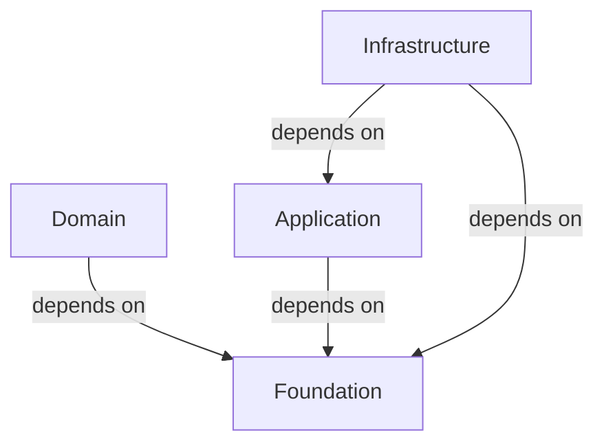

# Foundation
## Foundational abstractions and contracts

The **Foundation** block provides low-level, reusable abstractions that are shared
across the entire system.

It contains **no domain logic**, **no application orchestration**, and
**no infrastructure concerns**.

Foundation exists to define **stable contracts and primitives** on top of which
all other blocks are built.

---

## Purpose

- Supply **primitive abstractions** (`Result`, `Port`, `Mapper`, `Message`, `Command`, `Event`).
- Enable explicit, intention-revealing boundaries.
- Support structured and predictable error handling.
- Provide a stable base reused by all other blocks.

---

## Dependency position

```mermaid
flowchart TD
    D[Domain] -->|depends on| F[Foundation]
    A[Application] -->|depends on| F
    I[Infrastructure] -->|depends on| A
    I -->|depends on| F
```

Foundation depends on nothing.
All other blocks may depend on Foundation.

---

## Core concepts

### Result

`Result` models the **explicit outcome** of an operation.

It is used when failure is part of normal behavior, such as:

- validation
- parsing
- rule evaluation
- boundary checks

A `Result` represents either success (`Ok`) or failure (`Err`), without relying on
exceptions for control flow.

Result is about **flow**, not about error representation.

---

### Errors

Foundation defines a structured **error model**.

Errors represent **what went wrong**, not **how control flows**.

They are:

- structured objects (message + metadata)
- debuggable
- composable and aggregatable
- usable both as return values and raised exceptions

Errors are commonly carried inside `Err`, but the two concepts are distinct:

- `Result` answers *whether* an operation succeeded.
- `Error` answers *why* it failed.

Foundation provides reusable error categories such as:

- validation errors
- rule violation errors
- structural or invariant errors

These error types are architecture-neutral and reusable across domains.

---

### Port

A `Port` represents a **boundary between components**.

Ports define *what is expected*, not *how it is implemented*.
They enable replacement, testing, and decoupling without imposing an architecture.

---

### Mapper

`Mapper` and `ResultMapper` define **explicit transformations** between types.

They make data conversion intentional and observable,
avoiding hidden or implicit mappings.

---

### Debuggable

`Debuggable` is a lightweight contract for exposing structured debug information.

It enables introspection without leaking internal state or implementation details.

---

### Messages

The Foundation block provides **Messages** as reusable abstractions for expressing intent, facts, and queries within the problem space.

Messages are **immutable** and **architecture-neutral**, making them suitable for use across all blocks in the system.

#### Message

A **Message** is the base abstraction for all messages.

It encapsulates:

- An immutable payload
- Message metadata such as identity, timestamps, or correlation information

MessageMetadata is intentionally separated from data to avoid leaking technical concerns into foundation logic.

#### Command

A **Command** represents an **intent to perform an action**.

Characteristics:

- Imperative meaning
- Expresses a request to change state
- May be accepted or rejected

Commands model *what someone wants to do* in the application.

#### Event

An **Event** represents a **fact that has already occurred**.

Characteristics:

- Expressed in the past tense
- Immutable and irreversible
- Records something that happened

Events model *what is known to be true* after a state transition.

#### Query

A **Query** represents an **intent to retrieve information**.

Characteristics:

- Does not modify state
- Expresses interest, not behavior
- Side-effect free

Queries model *what someone wants to know*.

!!! note "Influence: CQRS literature"
    The distinction between Commands, Events, and Queries is inspired by CQRS concepts described by multiple authors, including Greg Young and Vaughn Vernon.
    ForgingBlocks treats these as semantic roles, not architectural mandates.

---

## Characteristics

- Pure Python (standard library only).
- Architecture-neutral.
- Stable, low-level abstractions.
- Used by all other blocks.
