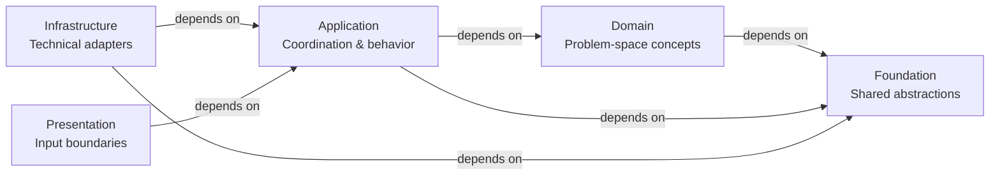

# Reference
## Overview of ForgingBlocks Components

## Reference Sections

- **[Foundation](foundation.md)** - Core abstractions and utilities (Result, Port, etc.)
- **[Domain](domain.md)** - Domain modeling abstractions (Entity, ValueObject, AggregateRoot)
- **[Application](application.md)** - Application layer patterns (UseCase, CommandHandler)
- **[Infrastructure](infrastructure.md)** - Infrastructure adapters and implementations
- **[Presentation](presentation.md)** - Input/output boundaries and presentation layer
- **[Testing](testing.md)** - Comprehensive testing reference and guidelines
