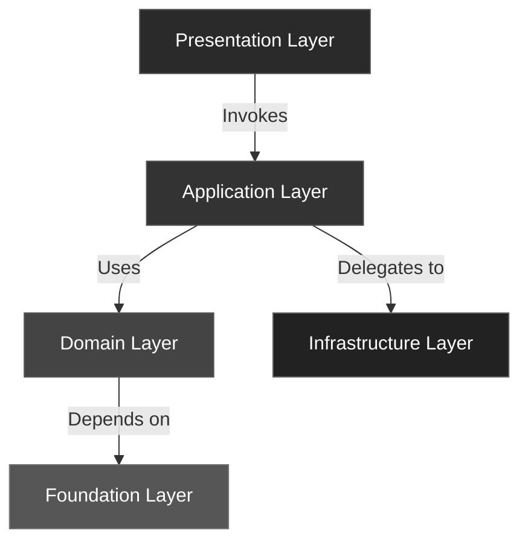

# Reference Index 🧩

Welcome to the **BuildingBlocks Reference** —
a detailed look at each architectural layer and its responsibilities.

This section provides **layer-by-layer documentation** of the toolkit’s design,
illustrating how **clean boundaries**, **ports**, and **contracts** work together
to create maintainable and framework-agnostic systems.

---

## 🧱 Layer Overview

| Layer | Responsibility | Depends On |
|--------|----------------|------------|
| [Foundation](foundation.md) | Core abstractions and contracts (`Result`, `Port`, `Mapper`) | None |
| [Domain](domain.md) | Business rules, Entities, Value Objects, Domain Events | Foundation |
| [Application](application.md) | Use cases, orchestration, inbound/outbound ports | Domain, Foundation |
| [Infrastructure](infrastructure.md) | Adapters and integrations (DB, messaging, I/O) | Application, Domain |
| [Presentation](presentation.md) | Entry points (API, CLI, events) | Application |

---

## 🧩 Architecture Diagram

---

## 🧠 How to Read This Section

- Each page in this reference documents **a single architectural layer**.
- Use it to explore dependencies, principles, and examples of real-world composition.
- The **Foundation** package defines reusable primitives.
  Higher layers build on top of these abstractions, never the other way around.

---

## 🔗 Quick Links

- [Foundation](foundation.md)
- [Domain](domain.md)
- [Application](application.md)
- [Infrastructure](infrastructure.md)
- [Presentation](presentation.md)

---

## ✅ Summary

Each layer plays a distinct role in your architecture.
By following the dependency direction (downward arrows in the diagram),
you maintain **clarity**, **testability**, and **modularity** throughout your project.

> “Architecture is the shape of intent — code is just the execution of that intent.”
