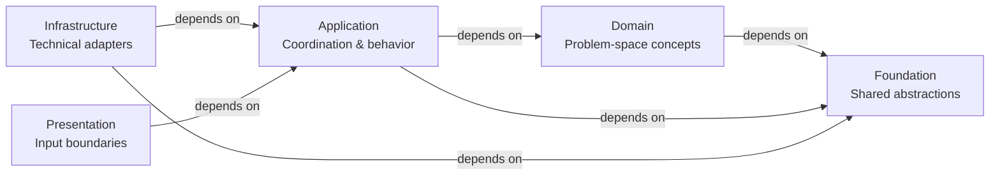

# Reference
## Overview of ForgingBlocks Components

```mermaid
flowchart LR
    D[Domain<br/>Problem-space concepts] -->|depends on| F[Foundation<br/>Shared abstractions]
    A[Application<br/>Coordination & behavior] -->|depends on| D
    A -->|depends on| F
    I[Infrastructure<br/>Technical adapters] -->|depends on| A
    I -->|depends on| F
    P[Presentation<br/>Input boundaries] -->|depends on| A
```
