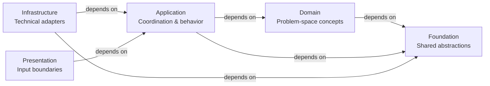

# Reference
---
## Quick summary

The **Reference** section defines the **meaning and responsibility** of each ForgingBlocks component. These pages are precise and definition-oriented — meant to be consulted as needed, not read linearly.

Components:
- **Foundation** — Core abstractions (Result, Port, Identified, Messages, Specification)
- **Domain** — Domain modeling (Entity, ValueObject, AggregateRoot, Specification)
- **Application** — Application layer patterns (ApplicationServicePort, CommandHandlerPort, RepositoryPort, EventStorePort)
- **Infrastructure** — Technical adapters and implementations (Repositories, Serializable)
- **Presentation** — Input/output boundaries

Dependencies point inward: Infrastructure/Presentation → Application → Domain, all depending on Foundation.

---

```mermaid
flowchart LR
    D[Domain<br/>Problem-space concepts] -->|depends on| F[Foundation<br/>Shared abstractions]
    A[Application<br/>Coordination & behavior] -->|depends on| D
    A -->|depends on| F
    I[Infrastructure<br/>Technical adapters] -->|depends on| A
    I -->|depends on| F
    P[Presentation<br/>Input boundaries] -->|depends on| A
```

---

## Reference Sections
- **[Foundation](foundation.md)** - Core abstractions and utilities (Result, Port, Identified, Messages, Specification, etc.)
- **[API Stability](api-stability.md)** - SemVer policy and public API stability guarantees
- **[Domain](domain.md)** - Domain modeling abstractions (Entity, ValueObject, AggregateRoot, Specification)
- **[Application](application.md)** - Application layer patterns (ApplicationServicePort, CommandHandlerPort, RepositoryPort, EventStorePort, SpecificationRepositoryPort)
- **[Infrastructure](infrastructure.md)** - Infrastructure adapters and implementations (Repositories, Serializable)
- **[Presentation](presentation.md)** - Input/output boundaries and presentation layer
