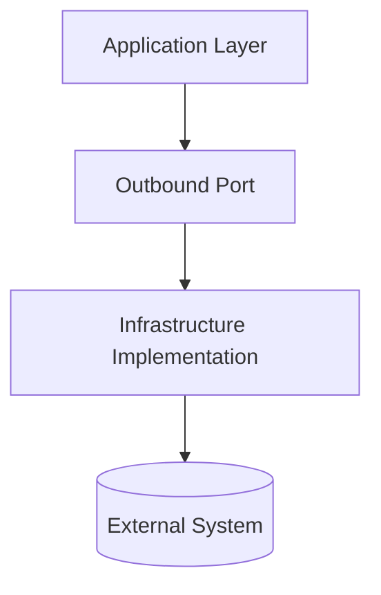

# Infrastructure Package 🏗️

The **infrastructure** package contains *technical implementations* of outbound ports defined in the application layer.

---

## 🧠 Purpose

Implements **adapters** that connect the application to external systems such as databases, APIs, and message brokers.

---

## ⚙️ Components

### Repository Implementations

Concrete classes that fulfill repository contracts.

```python
class SqlUserRepository(UserRepository):
    async def save(self, user: User) -> None:
        await db.execute("INSERT INTO users ...", user.to_dict())
```

### Event Publisher

Publishes domain events using the configured message bus or dispatcher.

```python
class RabbitMQEventPublisher(EventPublisher):
    def __init__(self, dispatcher: MessageDispatcher):
        self.dispatcher = dispatcher

    async def publish(self, event: DomainEvent) -> None:
        await self.dispatcher.dispatch(event)
```

### Message Bus / Dispatcher

Implements event and command transport.

```python
class RabbitMQMessageBus(MessageBus):
    async def dispatch(self, message: Message) -> None: ...
    async def listen(self, topic: str) -> None: ...
```

---

## 🧩 Diagram



---

## 🧭 Cross-links

- See also: [Application Layer](application.md) — defines outbound ports.
- See also: [Presentation Layer](presentation.md) — inbound adapters.

---

## ✅ Summary

| Aspect | Description |
|--------|--------------|
| **Responsibility** | Implement outbound ports and manage integrations |
| **Depends on** | Application, Domain |
| **Used by** | None |
| **Should not depend on** | Presentation |
