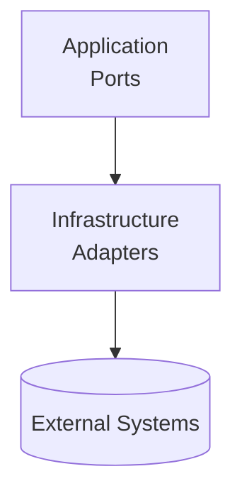

# Infrastructure
## Technical adapters to external systems

The **Infrastructure** block provides concrete implementations of ports defined in the Application block.
It contains all technical details.

---

## Purpose

- Fulfill outbound ports using real technology.
- Integrate with databases, APIs, queues, filesystems, etc.
- Keep technical concerns separate from behavior and rules.

---

---

## Typical Elements

### **Repositories**
SQL, NoSQL, in‑memory, key‑value stores.

### **Message Brokers & Event Systems**
Adapters for RabbitMQ, Redis, Kafka, etc.

### **External API Clients**
HTTP, gRPC, or other remote integrations.

---

## Characteristics

- May use frameworks and libraries.
- Swappable implementations.
- Contains I/O, serialization, networking, persistence.
