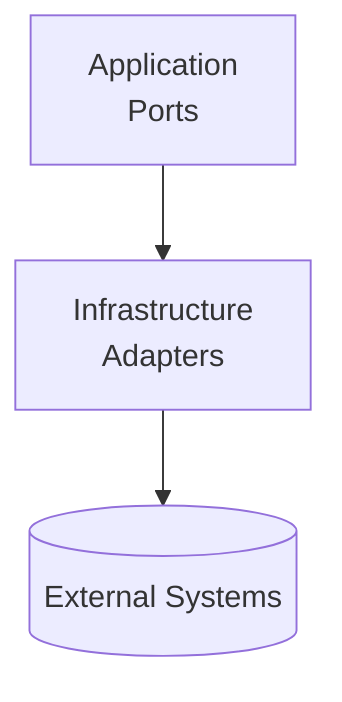

# Infrastructure
## Technical adapters to external systems

The **Infrastructure** block provides concrete implementations of ports defined in the Application block.
It contains all technical details.
---
## Quick summary

The **Infrastructure** block provides **concrete implementations** of the outbound ports defined in the Application block. It handles all **technical details** — databases, APIs, message brokers, filesystems, serialization, networking — so the Application and Domain remain pure and testable.

Core implementations:
- **Repositories** — In-memory, aggregate-based read/write stores
- **Message Buses** — In-memory dispatch of commands, events, and queries
- **Event Stores & Event Buses** — Append-only event storage and publish/subscribe
- **Unit of Work** — Transactional boundaries with commit/rollback
- **Serialization** — `Serializable` protocol for dictionary round-tripping
- **Caching** — In-memory key-value storage
- **Logging** — Standard-library logging adapter
- **HTTP Client** — URL-based HTTP requests
- **File System** — OS-level file operations

Characteristics:
- May use frameworks and libraries
- Swappable implementations
- Contains I/O, serialization, networking, persistence

Depends on **Application** (for port definitions) and **Foundation**; does not depend on Domain or Presentation.

---
## Purpose

- Fulfill outbound ports using real technology.
- Integrate with databases, APIs, queues, filesystems, etc.
- Keep technical concerns separate from behavior and rules.
- Provide swappable adapters so application code never depends on infrastructure details.

---
## Architecture

```mermaid
flowchart TD
    A[Application<br/>Ports] --> I[Infrastructure<br/>Adapters]
    I --> EXT[(External Systems)]
```

The Infrastructure block sits at the outermost layer. It implements the contracts
defined by Application outbound ports and communicates with real external systems.
Application code depends only on the port abstractions, never on concrete adapters.

---
## Repositories

Repositories bridge the gap between domain aggregates and persistence.

### In-Memory Write Repository
An append-only store that keeps aggregates in a dictionary keyed by identity.
Supports `get`, `add`, and `remove` operations. Suitable for testing and
prototyping.

### In-Memory Read Repository
A query-oriented store that indexes projections by identity. Supports
read-only access patterns for CQRS query sides.

### Aggregate Repository
A repository base class that integrates with `UnitOfWorkPort` and
`EventBusPort`. Tracks new and dirty aggregates, flushes events on commit,
and enforces identity constraints.

### Base Repository
Provides shared infrastructure for identity-keyed storage: `get`, `add`,
`remove`, `contains`, and iteration. Concrete repositories extend this
to add domain-specific query methods.

---
## Message Buses

### In-Memory Message Bus
A synchronous message dispatcher that routes commands, queries, and events
to registered handlers. Supports `register` for handler binding and
`dispatch` for message delivery.

### Command Sender
A thin adapter that wraps a message bus, implementing `CommandSenderPort`.
Sends commands asynchronously without waiting for a result.

### Event Publisher
A thin adapter that wraps a message bus, implementing `EventPublisherPort`.
Publishes domain events for downstream consumers.

### Query Fetcher
A thin adapter that wraps a message bus, implementing `QueryFetcherPort`.
Dispatches queries and returns typed results.

---
## Event Stores & Event Buses

### In-Memory Event Store
An append-only event log that stores domain events in chronological order.
Supports `append` with optimistic concurrency (expected version check) and
`get_events` for rebuilding aggregate state. Implements `EventStorePort`.

### In-Memory Event Bus
A publish/subscribe event bus that delivers domain events to registered
handlers. Implements `EventBusPort` with `publish` and `subscribe`
operations. Events are delivered synchronously to all subscribers.

---
## Unit of Work

### In-Memory Unit of Work
Manages a transactional boundary around repository operations. Tracks new
and dirty aggregates via registered repositories, flushes events on commit,
and provides `commit` / `rollback` semantics. Implements `UnitOfWorkPort`.

The Unit of Work pattern ensures that multiple repository operations within
a single use case are treated as one atomic unit.

---
## Serialization

### Serializable Protocol
A structural protocol for objects that can round-trip through dictionaries
via `to_dict()` and `from_dict()`. Any class with matching method signatures
satisfies the protocol automatically — no inheritance or registration needed.

This enables generic serialization infrastructure (JSON adapters, database
mappers, event stores) to work with any compliant type.

---
## Caching

### In-Memory Cache
A dictionary-backed key-value cache that implements `CachePort`. Supports
`get`, `set`, `delete`, and `clear` operations. Useful for test doubles
and simple caching scenarios.

---
## Logging

### Standard Library Logger
A logging adapter that wraps Python's `logging` module, implementing
`LoggerPort`. Provides `debug`, `info`, `warning`, and `error` methods
with the standard library's formatting and handler support.

---
## HTTP Client

### URLLib Client
An HTTP client adapter built on Python's `urllib`, implementing
`ExternalServicePort`. Supports GET and POST requests with headers,
timeout configuration, and response parsing.

---
## File System

### OS File System
A filesystem adapter that wraps Python's `os` and `pathlib` modules,
implementing `FileSystemPort`. Supports `read`, `write`, `delete`,
`exists`, and directory listing operations.

---
## What the Infrastructure block does not do

The Infrastructure block does **not**:

- Define business rules or domain logic
- Orchestrate workflows (that belongs to Application)
- Make architectural decisions about port shape
- Depend on Presentation or Domain layers

---
## Summary

The Infrastructure block provides **concrete, swappable adapters** for
outbound ports. Each adapter encapsulates a specific technology concern
and can be replaced without affecting application or domain code.

Its purpose is technical implementation, not policy or behavior.

---
## Glossary

!!! note "Repository"
    An adapter that persists and retrieves domain aggregates. Repositories
    implement `RepositoryPort` and encapsulate storage details.

!!! note "Message Bus"
    An adapter that dispatches messages (commands, queries, events) to
    registered handlers. Implements `MessageBusPort`.

!!! note "Command Sender"
    A fire-and-forget adapter for sending commands asynchronously.
    Implements `CommandSenderPort`.

!!! note "Event Publisher"
    An adapter that publishes domain events to downstream consumers.
    Implements `EventPublisherPort`.

!!! note "Query Fetcher"
    An adapter that dispatches queries and returns typed results.
    Implements `QueryFetcherPort`.

!!! note "Event Store"
    An append-only store for domain events, supporting event sourcing
    and optimistic concurrency. Implements `EventStorePort`.

!!! note "Event Bus"
    A publish/subscribe mechanism for delivering domain events to
    registered handlers. Implements `EventBusPort`.

!!! note "Unit of Work"
    A transactional boundary that coordinates multiple repository
    operations. Implements `UnitOfWorkPort`.

!!! note "Serializable"
    A structural protocol for dictionary round-tripping via
    `to_dict()` and `from_dict()`.

!!! note "Cache"
    A key-value store for temporary data. Implements `CachePort`.

!!! note "Logger"
    A logging abstraction wrapping Python's standard library.
    Implements `LoggerPort`.

!!! note "HTTP Client"
    An HTTP request adapter. Implements `ExternalServicePort`.

!!! note "File System"
    A filesystem operations adapter. Implements `FileSystemPort`.
