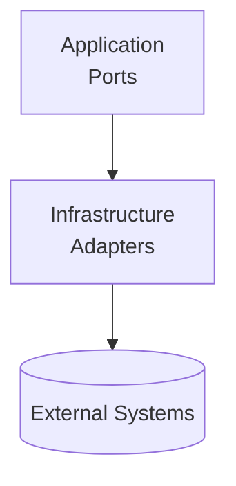

# Infrastructure
## Technical adapters to external systems

The **Infrastructure** block provides concrete implementations of ports defined in the Application block.
It contains all technical details.
---
## Quick summary

The **Infrastructure** block provides **concrete implementations** of the outbound ports defined in the Application block. It handles all **technical details** — databases, APIs, message brokers, filesystems, serialization, networking — so the Application and Domain remain pure and testable.

Typical implementations:
- **Repositories** — SQL, NoSQL, in-memory, key-value stores
- **Message Brokers** — RabbitMQ, Redis, Kafka, in-memory
- **External API Clients** — HTTP, gRPC, third-party integrations
- **Unit of Work** — Transaction management
- **Serialization** — `Serializable` protocol for dictionary round-tripping

Characteristics:
- May use frameworks and libraries
- Swappable implementations
- Contains I/O, serialization, networking, persistence

Depends on **Application** (for port definitions) and **Foundation**; does not depend on Domain or Presentation.

---
## Purpose

- Fulfill outbound ports using real technology.
- Integrate with databases, APIs, queues, filesystems, etc.
- Keep technical concerns separate from behavior and rules.

---

```mermaid
flowchart TD
    A[Application<br/>Ports] --> I[Infrastructure<br/>Adapters]
    I --> EXT[(External Systems)]
```

---

## Typical Elements

### **Repositories**
SQL, NoSQL, in‑memory, key‑value stores.

### **Message Brokers & Event Systems**
Adapters for RabbitMQ, Redis, Kafka, etc.

### **External API Clients**
HTTP, gRPC, or other remote integrations.

### **Serialization**
The `Serializable` protocol defines a structural contract for objects that can
be converted to and from plain dictionaries via `to_dict()` and `from_dict()`.

It is structural — any class that defines both methods with matching signatures
satisfies the protocol automatically, without explicit registration or
inheritance. This enables generic serialization infrastructure (JSON adapters,
database mappers, event stores) to work with any compliant type.

---

## Characteristics

- May use frameworks and libraries.
- Swappable implementations.
- Contains I/O, serialization, networking, persistence.
