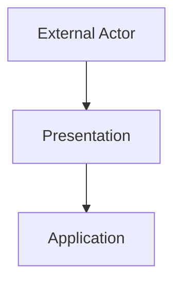

# Presentation
## Entry points and interaction boundaries

The **Presentation** block handles all incoming interactions.
It translates external inputs (HTTP, CLI, events) into calls to the Application block.

---

## Purpose

- Provide entry points for users or systems.
- Parse and validate raw input.
- Convert input formats into application‑level data.

---

---

## Typical Elements

### **HTTP / REST / GraphQL Handlers**
Thin request handlers that delegate to Application.

### **CLI Commands**
Command‑line entry points.

### **Message Listeners**
Queue or event consumer adapters.

---

## Characteristics

- May depend on frameworks.
- No business rules.
- Designed to remain thin and delegating.
