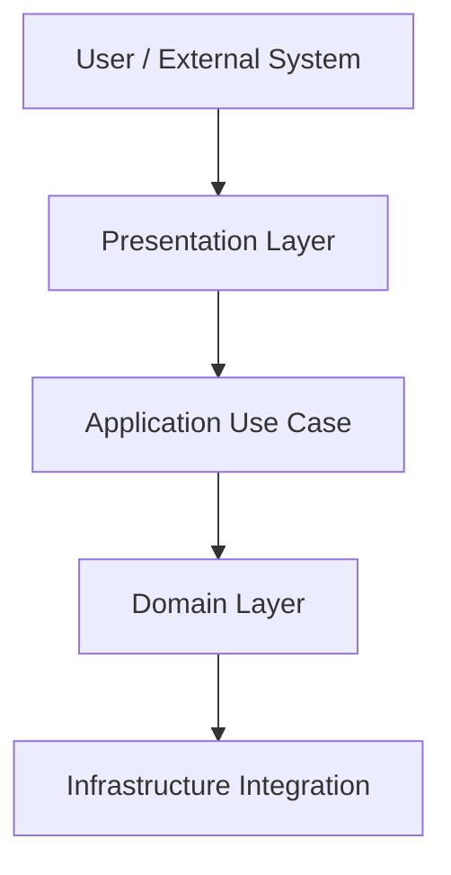

# Presentation Package 🧩

The **presentation** package is the system’s *entry point*.
It handles user or system interactions and delegates execution to the **application layer**.

---

## 🧠 Purpose

Implements **inbound adapters** such as APIs, CLI commands, or event consumers.

---

## ⚙️ Components

### REST API Controllers

```python
@router.post("/users")
async def register_user(request: RegisterUserRequest) -> Response:
    result = await register_user_service.execute(request.to_dto())
    return Response(result.value if result.is_ok() else result.error)
```

### CLI Commands

```python
@click.command()
def run_task():
    service = container.get(RunTaskService)
    service.execute()
```

### Event Consumers

```python
class UserCreatedConsumer:
    async def on_event(self, event: UserCreatedEvent):
        ...
```

---

## 🧩 Diagram



---

## 🧭 Cross-links

- See also: [Application Layer](application.md) — orchestrates requests.
- See also: [Infrastructure Layer](infrastructure.md) — handles outbound interactions.

---

## ✅ Summary

| Aspect | Description |
|--------|--------------|
| **Responsibility** | Handle inbound communication (API, CLI, messaging) |
| **Depends on** | Application |
| **Used by** | None |
| **Should not depend on** | Infrastructure |
