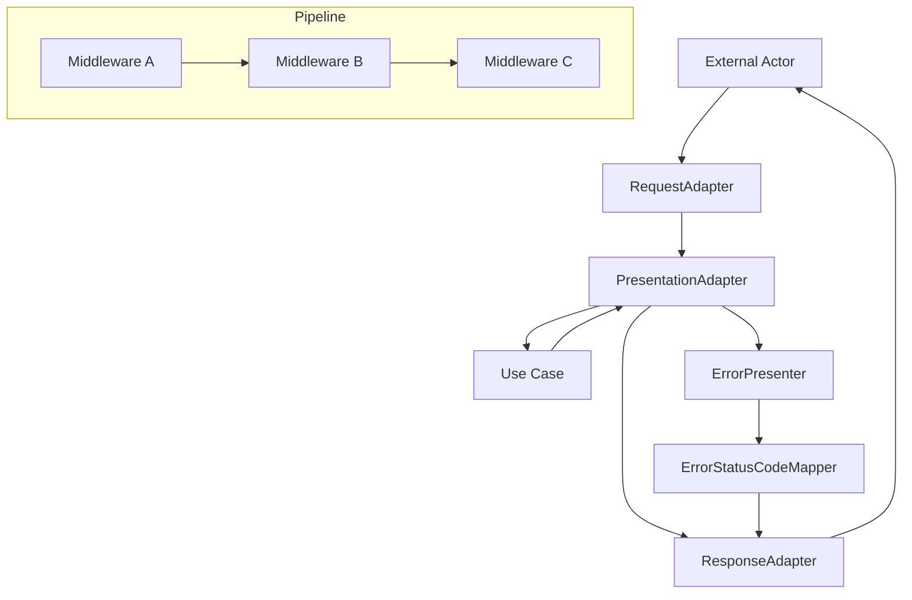

# Presentation
## Entry points and interaction boundaries

The **Presentation** block handles all incoming interactions.
It translates external inputs (HTTP, CLI, events) into calls to the Application block.
---
## Quick summary

The **Presentation** block is the **entry point** for users and external systems.
It translates transport-level requests into application input, invokes use cases,
and converts application output back into transport-level responses.

Core abstractions:
- **RequestAdapter** — Translates raw transport requests into use-case input
- **ResponseAdapter** — Translates use-case output (and errors) into transport responses
- **PresentationAdapter** — Orchestrator that wires adapters to a use case
- **PresenterPort** — Contract for rendering success and error output
- **ErrorPresenter** — Converts application errors into user-facing view models
- **ErrorStatusCodeMapper** — Assigns HTTP-like status codes to error messages
- **ErrorViewModel / ErrorMessageModel** — Display-ready error data structures
- **Middleware / Pipeline** — Composable chain for cross-cutting concerns

Characteristics:
- May depend on frameworks
- No business rules
- Designed to remain thin and delegating

Depends on **Application** (for inbound ports); does not depend on Domain or Infrastructure.

---
## Purpose

- Provide entry points for users or systems.
- Parse and validate raw input.
- Convert input formats into application-level data.
- Convert application output (including errors) into transport responses.
- Compose cross-cutting concerns (logging, auth, metrics) via middleware.

---
## Architecture


```mermaid
flowchart TD
    USER[External Actor] --> REQ[RequestAdapter]
    REQ --> PA[PresentationAdapter]
    PA --> UC[Use Case]
    UC --> PA
    PA --> RES[ResponseAdapter]
    RES --> USER
    PA --> EP[ErrorPresenter]
    EP --> ESM[ErrorStatusCodeMapper]
    ESM --> RES

    subgraph Pipeline
        MW1[Middleware A] --> MW2[Middleware B]
        MW2 --> MW3[Middleware C]
    end
```

The PresentationAdapter orchestrates the full lifecycle: adapt → execute → respond.
Errors flow through ErrorPresenter → ErrorStatusCodeMapper before being rendered
by ResponseAdapter. The Pipeline wraps cross-cutting middleware around the handler.

---
## Request Adapter

The `RequestAdapter[RawRequest, UseCaseInput]` protocol translates a raw
transport request into typed use-case input.

Responsibilities:
- Deserialize transport formats (JSON, form data, query strings)
- Extract and normalize headers, parameters, and body
- Validate and coerce raw data into domain-appropriate types

Characteristics:
- Framework-aware (e.g. FastAPI `Request`, CLI `argv`)
- Stateless — produces a value, no side effects
- Returns a typed DTO or command for the use case

---
## Response Adapter

The `ResponseAdapter[UseCaseOutput, RawResponse]` protocol translates
application output into transport responses.

Two methods:
- `adapt(output)` — converts successful use-case output into a response
- `adapt_error(view_model)` — converts an `ErrorViewModel` into an error response

Characteristics:
- Framework-aware (sets HTTP status codes, serializes JSON bodies)
- Handles both happy and error paths
- Produces the final transport response the caller receives

---
## Presentation Adapter

The `PresentationAdapter` orchestrates the full request/response lifecycle.

```
1. Adapt raw request → use-case input (via RequestAdapter)
2. Execute use case
3a. Success → adapt output → response (via ResponseAdapter)
3b. Result.Err → ErrorPresenter → ErrorStatusCodeMapper → adapt_error
3c. Exception raised → ErrorPresenter → ErrorStatusCodeMapper → adapt_error
```

Key design decisions:
- Handles **both** `Result.Err` and raised exceptions (callers choose their style)
- When `ErrorPresenter` is `None`, exceptions propagate unchanged
- Status codes are assigned by `ErrorStatusCodeMapper` after error conversion

---
## Error Handling

### Error Presenter
The `ErrorPresenter` class converts errors into `ErrorViewModel` instances.
It handles framework `Error` objects, `Result.Err` values, plain exceptions,
and unknown types via a fallback. Aggregate errors (`CombinedErrors`,
`FieldErrors`) are recursively decomposed into individual messages.

### Error Status Code Mapper
The `ErrorStatusCodeMapper` assigns HTTP-like status codes:
- `ValidationError` → 400
- `RuleViolationError` → 409
- `CombinedErrors` / `FieldErrors` → 422
- Unknown / unexpected → 500

### Error View Model
`ErrorViewModel` holds a list of `ErrorMessageModel` entries. Each message
carries a `title`, optional `detail`, optional `field` reference, optional
machine-readable `code`, and optional `status_code`.

---
## Presenter Port

The `PresenterPort[ResponseType]` protocol defines how presentation adapters
render output. It extends `InboundPort`, consistent with `UseCase` and
`MessageHandler`.

Two methods:
- `present(response)` — renders a successful application response
- `present_error(error)` — renders an application error

This contract is orthogonal to the `RequestAdapter`/`ResponseAdapter` pattern.
An adapter may call both a `Pipeline` for processing and a `PresenterPort`
for rendering.

---
## Middleware Pipeline

### Middleware Protocol
The `Middleware[RequestType, ResponseType]` protocol defines cross-cutting
interceptors. Each middleware receives the request and a `next_handler`
callable. It may:
- Transform the request before delegating
- Transform the response after delegating
- Short-circuit by returning without calling `next_handler`

Middleware does **not** extend `Port` — its shape `(request, next_handler) → response`
is a different semantic category.

### Pipeline
The `Pipeline` class composes middleware into an immutable, right-to-left chain.
The first middleware in the list executes first on the way in and last on the
way out. The chain is pre-built at construction time — `execute()` is a single
delegation.

```
[A, B, C] → A wraps B wraps C wraps handler
Inbound:  A → B → C → handler
Outbound: A ← B ← C ← handler
```

---
## What the Presentation block does not do

The Presentation block does **not**:

- Contain business rules or domain logic
- Implement persistence or I/O directly
- Define transactional boundaries
- Make decisions about system behavior beyond input translation

---
## Summary

The Presentation block provides **clean, typed entry points** for external
interactions. It translates transport concerns into application calls and
renders results back through configurable adapters and middleware.

Its purpose is translation and orchestration at the boundary — not policy.

---
## Glossary

!!! note "Request Adapter"
    A protocol that translates raw transport requests into typed use-case
    input. Implements transport-specific deserialization.

!!! note "Response Adapter"
    A protocol that translates use-case output into transport responses.
    Handles both success (`adapt`) and error (`adapt_error`) paths.

!!! note "Presentation Adapter"
    An orchestrator that wires a use case to request/response adapters
    with error handling. Supports both `Result.Err` and exceptions.

!!! note "Presenter Port"
    A protocol for rendering success and error output. Extends `InboundPort`.

!!! note "Error Presenter"
    A pure transformation that converts errors into display-ready
    `ErrorViewModel` instances. Decomposes aggregate errors recursively.

!!! note "Error Status Code Mapper"
    Assigns HTTP-like status codes to error messages based on error type.

!!! note "Error View Model"
    A frozen collection of `ErrorMessageModel` entries ready for
    presentation.

!!! note "Error Message Model"
    A single error message with title, detail, field, code, and optional
    status code.

!!! note "Middleware"
    A protocol for cross-cutting interceptors. May transform, observe,
    or short-circuit the request/response flow.

!!! note "Pipeline"
    An immutable chain of middleware composed around a terminal handler.
    Right-to-left composition, pre-built at construction.
