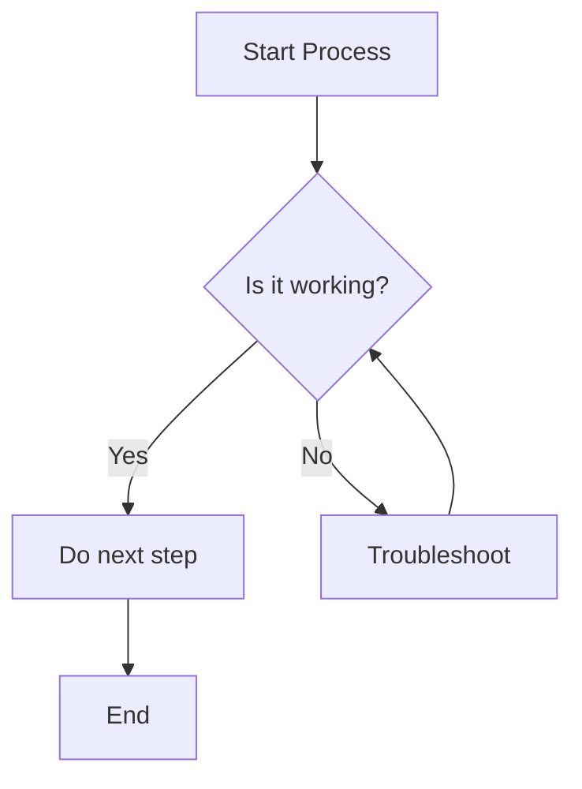

# My Page with a Diagram

A simple flowchart illustrating a decision process:

```mermaid
graph TD
    A[Start Process] --> B{Is it working?};
    B -->|Yes| C[Do next step];
    B -->|No| D[Troubleshoot];
    C --> E[End];
    D --> B;
```
